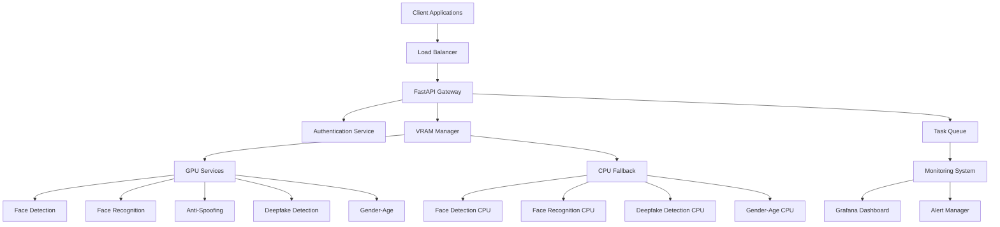

# FaceSocial Backend AI Services - System Overview

## Executive Summary

The FaceSocial Backend AI Services system is a comprehensive VRAM-optimized AI platform designed specifically for RTX 3060 Laptop hardware with 6GB VRAM. The system provides intelligent memory management, dynamic model loading, and seamless CPU fallback capabilities to maximize performance while ensuring reliable service delivery.

---

## 🎯 System Objectives

### Primary Goals
1. **Efficient VRAM Utilization**: Maximize GPU memory usage while preventing OOM errors
2. **High Performance**: Deliver real-time AI processing with minimal latency
3. **Scalability**: Support multiple concurrent users and batch operations
4. **Reliability**: Ensure 99.9% uptime with automatic failover mechanisms
5. **Flexibility**: Easy model addition, removal, and configuration updates

### Target Performance Metrics
- **Face Detection**: <100ms per image (GPU), <300ms (CPU fallback)
- **Face Recognition**: <200ms per face (GPU), <500ms (CPU fallback)
- **Anti-Spoofing**: <150ms per face (GPU), <400ms (CPU fallback)
- **Deepfake Detection**: <2s per video frame (GPU), <5s (CPU fallback)
- **System Availability**: 99.9% uptime with <1% failover rate

---

## 🏗️ Architecture Overview

### High-Level Architecture



### Component Architecture

#### 1. API Gateway Layer
- **FastAPI Framework**: Async/await support for high concurrency
- **Authentication**: JWT tokens with role-based access control
- **Rate Limiting**: Per-user and per-endpoint rate limits
- **Request Validation**: Pydantic models for type safety
- **WebSocket Support**: Real-time streaming capabilities

#### 2. VRAM Management Layer
- **Memory Allocator**: Dynamic VRAM allocation with priority-based loading
- **Model Manager**: Model lifecycle management (load/unload/update)
- **Fallback Controller**: Intelligent CPU fallback decisions
- **Resource Monitor**: Real-time memory and performance tracking

#### 3. AI Services Layer
- **GPU Services**: CUDA-accelerated model inference
- **CPU Services**: Fallback implementations for all models
- **Batch Processor**: Efficient bulk operation handling
- **Cache Manager**: Model output caching for repeated requests

#### 4. Infrastructure Layer
- **Container Runtime**: Docker with NVIDIA runtime support
- **Orchestration**: Docker Compose for development, Kubernetes for production
- **Storage**: Model storage with versioning and backup
- **Networking**: Secure communication with TLS encryption

---

## 💾 Hardware Requirements

### Minimum Requirements
```yaml
GPU:
  Model: RTX 3060 Laptop or equivalent
  VRAM: 6GB GDDR6
  CUDA: 12.0+
  Compute Capability: 8.6

CPU:
  Cores: 8+ (Intel i7 / AMD Ryzen 7)
  RAM: 16GB DDR4
  Architecture: x64

Storage:
  Type: SSD
  Size: 100GB+ available
  Speed: 500MB/s read/write

Network:
  Bandwidth: 1Gbps+
  Latency: <10ms to clients
```

### Recommended Requirements
```yaml
GPU:
  Model: RTX 4060/4070 or better
  VRAM: 8GB+ GDDR6X
  CUDA: 12.9
  Compute Capability: 8.9+

CPU:
  Cores: 12+ (Intel i9 / AMD Ryzen 9)
  RAM: 32GB DDR5
  Architecture: x64

Storage:
  Type: NVMe SSD
  Size: 500GB+
  Speed: 3000MB/s read/write

Network:
  Bandwidth: 10Gbps
  Latency: <5ms to clients
```

---

## 🛠️ Technology Stack

### Core Technologies
```yaml
Runtime:
  Language: Python 3.11+
  Framework: FastAPI 0.104+
  ASGI Server: Uvicorn with Gunicorn

AI/ML:
  Inference: ONNXRuntime 1.16+
  GPU Acceleration: CUDA 12.9 + cuDNN 9.10
  Image Processing: OpenCV 4.8+
  Computer Vision: MediaPipe, InsightFace

Containerization:
  Base Image: nvidia/cuda:12.9.0-cudnn-devel-ubuntu22.04
  Runtime: Docker 24.0+ with NVIDIA Container Toolkit
  Orchestration: Docker Compose / Kubernetes

Monitoring:
  Metrics: Prometheus 2.47+
  Visualization: Grafana 10.0+
  Logging: Structured JSON with ELK stack
  Tracing: OpenTelemetry with Jaeger

Storage:
  Model Storage: Local filesystem with backup
  Cache: Redis 7.0+ for session and result caching
  Database: PostgreSQL 15+ for metadata and analytics
```

### Development Tools
```yaml
Code Quality:
  Linting: Ruff, Black, isort
  Type Checking: mypy
  Testing: pytest with async support
  Coverage: pytest-cov

Documentation:
  API Docs: FastAPI auto-generated OpenAPI
  Code Docs: Sphinx with autodoc
  Architecture: Mermaid diagrams

CI/CD:
  Version Control: Git with conventional commits
  CI Platform: GitHub Actions / GitLab CI
  Container Registry: Docker Hub / Harbor
  Deployment: GitOps with ArgoCD
```

---

## 🚀 Performance Characteristics

### VRAM Allocation Strategy

```yaml
Critical Zone (2GB):
  Purpose: Essential models for real-time operations
  Models: Face Detection (YOLO v10n)
  Priority: Always loaded
  Eviction: Never

High Priority Zone (2.5GB):
  Purpose: Primary AI services
  Models: Face Recognition (smallest), Anti-Spoofing
  Priority: Loaded on first request
  Eviction: LRU when memory pressure

Flexible Zone (1.5GB):
  Purpose: Secondary services and batch processing
  Models: Deepfake Detection, Gender-Age, larger FR models
  Priority: Loaded on demand
  Eviction: Aggressive LRU, immediate CPU fallback
```

### Throughput Estimates

| Operation | GPU (req/sec) | CPU Fallback (req/sec) | Latency P95 |
|-----------|---------------|------------------------|-------------|
| Face Detection | 50-100 | 10-20 | <150ms |
| Face Recognition | 20-40 | 5-10 | <300ms |
| Anti-Spoofing | 30-60 | 8-15 | <200ms |
| Deepfake Detection | 2-5 | 0.5-1 | <3s |
| Gender-Age | 40-80 | 15-30 | <100ms |

### Scaling Characteristics

```yaml
Horizontal Scaling:
  Method: Load balancer with session affinity
  Scaling Factor: Linear up to GPU memory limit
  Load Distribution: Round-robin with health checks

Vertical Scaling:
  GPU Memory: Direct impact on concurrent model capacity
  CPU Cores: Affects fallback performance and batch processing
  Network Bandwidth: Critical for image/video uploads

Auto-scaling Triggers:
  Scale Up: GPU utilization >80% for 5 minutes
  Scale Down: GPU utilization <20% for 15 minutes
  Emergency: Queue depth >100 requests
```

---

## 🔒 Security Architecture

### Authentication & Authorization
```yaml
API Authentication:
  Method: JWT tokens with RS256 signing
  Expiration: 1 hour access, 24 hour refresh
  Scopes: role-based permissions (admin, user, service)

Rate Limiting:
  Per User: 100 requests/minute
  Per IP: 1000 requests/minute
  Per Endpoint: Custom limits based on complexity

Input Validation:
  Image Upload: Max 10MB, supported formats (JPEG, PNG, WebP)
  Video Upload: Max 100MB, supported formats (MP4, WebM)
  Request Sanitization: All inputs validated with Pydantic
```

### Data Privacy
```yaml
Data Handling:
  Processing: In-memory only, no persistent storage
  Retention: Request data deleted after response
  Logging: No sensitive data in logs

Model Security:
  Isolation: Each model runs in separate process space
  Access Control: Model files protected with file permissions
  Integrity: Model checksum validation on load

Network Security:
  Encryption: TLS 1.3 for all external communication
  Internal: mTLS for service-to-service communication
  Firewall: Restricted ports, deny-by-default policies
```

---

## 📊 Monitoring & Observability

### Key Metrics
```yaml
Performance Metrics:
  - Request latency (P50, P95, P99)
  - Throughput (requests per second)
  - Error rates by endpoint and error type
  - GPU/CPU utilization and memory usage

Business Metrics:
  - Model usage patterns and popularity
  - User engagement and retention
  - Cost per request and resource efficiency
  - SLA compliance and availability

System Health:
  - Container health and restart counts
  - Memory leaks and garbage collection
  - Network connectivity and bandwidth
  - Storage usage and I/O performance
```

### Alerting Strategy
```yaml
Critical Alerts (Page immediately):
  - Service unavailable (>1 minute)
  - GPU memory exhaustion
  - Error rate >5% (>5 minutes)
  - Response time >5s (>3 minutes)

Warning Alerts (Slack notification):
  - GPU utilization >90% (>10 minutes)
  - Disk space <10% remaining
  - High request queue depth
  - Unusual traffic patterns

Informational Alerts (Dashboard only):
  - Model performance degradation
  - Resource usage trends
  - Capacity planning recommendations
  - Maintenance windows and updates
```

---

## 🔄 Development Workflow

### Development Process
```yaml
Local Development:
  Environment: Docker Compose with volume mounts
  Hot Reload: Code changes reflected without restart
  Testing: Pytest with GPU mocking for CI/CD
  Debugging: Remote debugging with VS Code

Staging Environment:
  Purpose: Integration testing and performance validation
  Data: Synthetic test data and anonymized samples
  Scale: Single node with production configuration
  Monitoring: Full observability stack enabled

Production Deployment:
  Method: Blue-green deployment with health checks
  Rollback: Automated rollback on health check failure
  Canary: Traffic splitting for gradual rollout
  Maintenance: Planned maintenance windows with notification
```

### Quality Assurance
```yaml
Code Quality:
  Coverage: >90% test coverage required
  Static Analysis: Ruff, mypy, security linting
  Performance: Benchmark tests for critical paths
  Documentation: API documentation auto-generated

Testing Strategy:
  Unit Tests: Model inference accuracy and performance
  Integration Tests: End-to-end API workflows
  Load Tests: Performance under concurrent load
  Chaos Tests: Failure scenarios and recovery
```

---

## 📋 Implementation Phases

### Phase 1: Core Infrastructure (Weeks 1-2)
- Docker environment setup with NVIDIA runtime
- FastAPI application scaffold with basic endpoints
- VRAM management foundation with memory monitoring
- Basic model loading and inference pipeline

### Phase 2: AI Services Implementation (Weeks 3-4)
- Face detection service with YOLO models
- Face recognition service with embedding management
- Anti-spoofing service with binary classification
- CPU fallback implementation for all services

### Phase 3: Advanced Features (Weeks 5-6)
- Deepfake detection service integration
- Gender-age estimation service
- MediaPipe and InsightFace integration
- Batch processing and queue management

### Phase 4: Production Readiness (Weeks 7-8)
- Comprehensive monitoring and alerting
- Performance optimization and caching
- Security hardening and audit
- Documentation completion and testing

---

*This overview provides the foundation for understanding the FaceSocial Backend AI Services system. Refer to subsequent documentation sections for detailed implementation specifications.*
