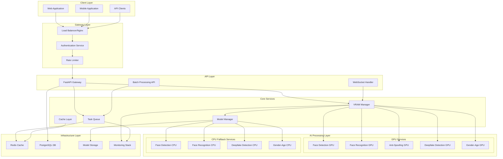
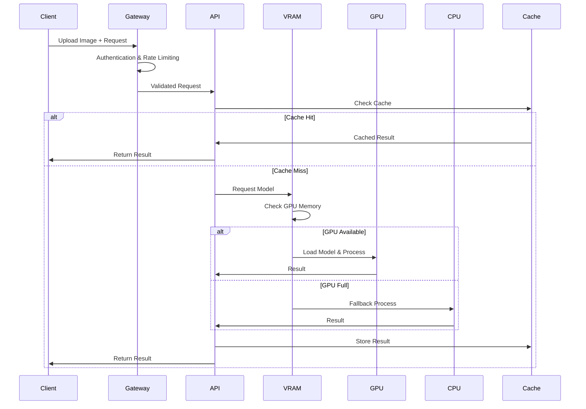
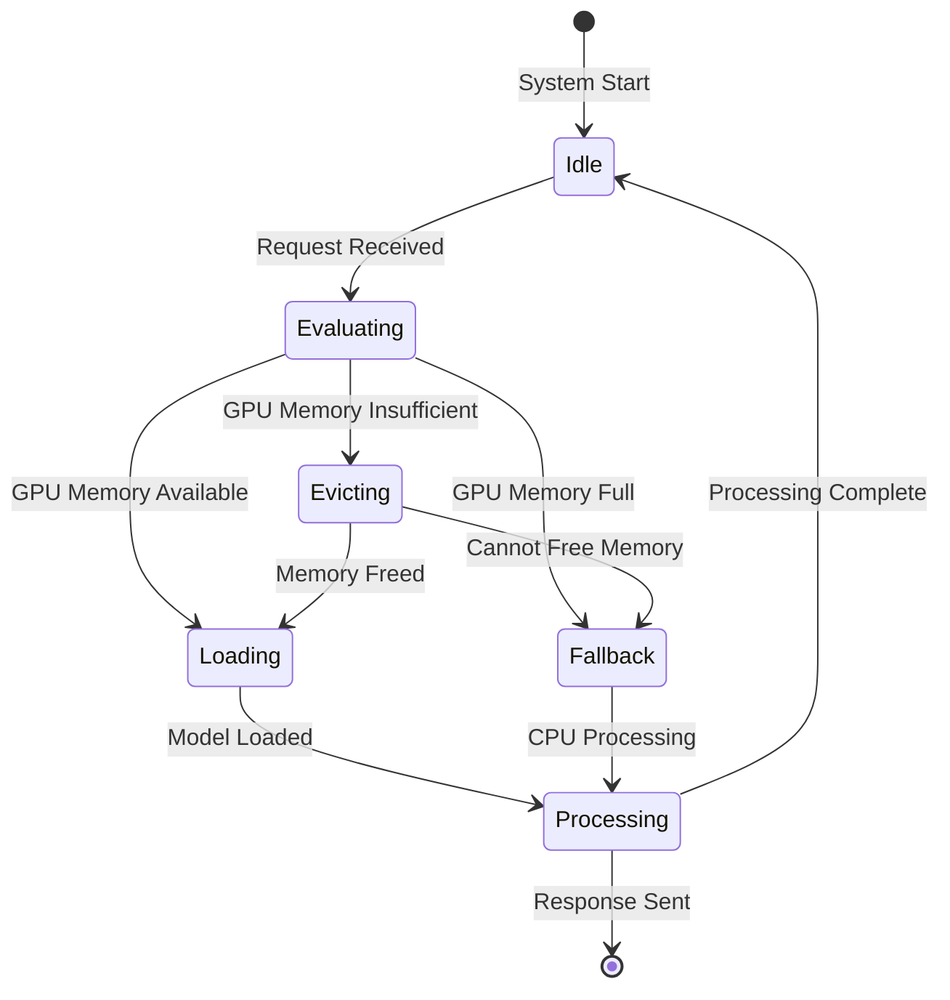

# System Architecture - FaceSocial Backend AI Services

## Architectural Principles

The FaceSocial Backend AI Services system follows a microservices-oriented architecture with intelligent resource management, designed specifically for GPU-constrained environments. The architecture emphasizes modularity, scalability, and efficient VRAM utilization.

---

## 🏗️ System Architecture Diagram



---

## 📊 Component Architecture

### 1. Client Layer
```yaml
Purpose: User interfaces and external integrations
Components:
  - Web Application (React/Vue.js)
  - Mobile Application (React Native/Flutter)
  - API Clients (Python SDK, JavaScript SDK)
  - Third-party integrations

Responsibilities:
  - User interface rendering
  - File upload handling
  - Real-time result display
  - Authentication token management
```

### 2. Gateway Layer
```yaml
Purpose: Traffic management, security, and routing
Components:
  - Load Balancer (Nginx/HAProxy)
  - Authentication Service (JWT validation)
  - Rate Limiter (Redis-based)
  - SSL Termination

Responsibilities:
  - Request routing and load distribution
  - Authentication and authorization
  - Rate limiting and DDoS protection
  - SSL/TLS encryption
```

### 3. API Layer
```yaml
Purpose: Request handling and response management
Components:
  - FastAPI Gateway (main REST API)
  - WebSocket Handler (real-time streaming)
  - Batch Processing API (bulk operations)
  - OpenAPI Documentation

Responsibilities:
  - HTTP request/response handling
  - Input validation and sanitization
  - Response formatting and compression
  - API documentation generation
```

### 4. Core Services Layer
```yaml
Purpose: Resource management and orchestration
Components:
  - VRAM Manager (memory allocation)
  - Model Manager (lifecycle management)
  - Task Queue (asynchronous processing)
  - Cache Layer (result caching)

Responsibilities:
  - Intelligent resource allocation
  - Model loading/unloading decisions
  - Task prioritization and queuing
  - Response caching and optimization
```

### 5. AI Processing Layer
```yaml
Purpose: AI model inference and processing
Components:
  GPU Services:
    - Face Detection (YOLO models)
    - Face Recognition (ArcFace, AdaFace)
    - Anti-Spoofing (Binary, Print-Replay)
    - Deepfake Detection
    - Gender-Age Estimation
  
  CPU Fallback Services:
    - MediaPipe Face Detection
    - CPU-optimized recognition models
    - Fallback deepfake detection
    - CPU gender-age estimation

Responsibilities:
  - Model inference execution
  - Result post-processing
  - Error handling and fallback
  - Performance monitoring
```

### 6. Infrastructure Layer
```yaml
Purpose: Data persistence and system monitoring
Components:
  - Redis Cache (session, results)
  - PostgreSQL Database (metadata, analytics)
  - File Storage (models, temporary files)
  - Monitoring Stack (Prometheus, Grafana)

Responsibilities:
  - Data persistence and caching
  - Model storage and versioning
  - Performance metrics collection
  - Health monitoring and alerting
```

---

## 🔄 Data Flow Architecture

### Request Processing Flow



### VRAM Management Flow



---

## 🧠 VRAM Management Strategy

### Memory Zone Architecture

```yaml
Critical Zone (2.0GB):
  Purpose: Always-loaded essential models
  Models:
    - YOLO v10n Face Detection (9MB)
    - Primary Anti-Spoofing Binary (1.9MB)
  Characteristics:
    - Never evicted
    - Highest priority
    - Real-time performance critical

High Priority Zone (2.5GB):
  Purpose: Primary AI services
  Models:
    - FaceNet VGGFace2 Recognition (89MB)
    - Anti-Spoofing Print-Replay (1.9MB)
    - Gender-Age Detection (1.3MB)
  Characteristics:
    - LRU eviction when needed
    - Fast reload priority
    - User-facing features

Flexible Zone (1.5GB):
  Purpose: Secondary and batch processing
  Models:
    - ArcFace R100 Recognition (249MB)
    - AdaFace IR101 Recognition (249MB)
    - Deepfake Detection (44MB)
    - YOLO v5s Face Detection (28MB)
  Characteristics:
    - Aggressive eviction
    - CPU fallback ready
    - Batch processing optimized
```

### Model Priority Matrix

| Model | VRAM (MB) | Priority | Zone | Fallback | Load Time |
|-------|-----------|----------|------|----------|-----------|
| YOLO v10n Face | 9 | Critical | Critical | MediaPipe | 50ms |
| Anti-Spoof Binary | 1.9 | Critical | Critical | None | 30ms |
| FaceNet VGG | 89 | High | High Priority | CPU Version | 200ms |
| Anti-Spoof Replay | 1.9 | High | High Priority | None | 30ms |
| Gender-Age | 1.3 | Medium | High Priority | CPU Version | 40ms |
| ArcFace R100 | 249 | Medium | Flexible | CPU Version | 600ms |
| AdaFace IR101 | 249 | Medium | Flexible | CPU Version | 600ms |
| Deepfake Detection | 44 | Low | Flexible | CPU Version | 150ms |
| YOLO v5s Face | 28 | Low | Flexible | MediaPipe | 100ms |

---

## 🔧 Service Integration Patterns

### Model Service Interface

```python
from abc import ABC, abstractmethod
from typing import Optional, Dict, Any, List
import numpy as np

class AIModelService(ABC):
    """Base interface for all AI model services"""
    
    @abstractmethod
    async def load_model(self, device: str = "cuda") -> bool:
        """Load model to specified device"""
        pass
    
    @abstractmethod
    async def unload_model(self) -> bool:
        """Unload model from memory"""
        pass
    
    @abstractmethod
    async def predict(self, 
                     input_data: np.ndarray,
                     **kwargs) -> Dict[str, Any]:
        """Run model inference"""
        pass
    
    @abstractmethod
    def get_memory_usage(self) -> Dict[str, int]:
        """Get current memory usage"""
        pass
    
    @abstractmethod
    def get_model_info(self) -> Dict[str, Any]:
        """Get model metadata"""
        pass

class FaceDetectionService(AIModelService):
    """Face detection service implementation"""
    
    def __init__(self, model_path: str, 
                 engine: str = "yolo"):  # yolo, mediapipe, insightface
        self.model_path = model_path
        self.engine = engine
        self.model = None
        self.device = None
    
    async def load_model(self, device: str = "cuda") -> bool:
        """Load face detection model"""
        # Implementation specific to detection engine
        pass
    
    async def predict(self, 
                     image: np.ndarray,
                     confidence_threshold: float = 0.5,
                     **kwargs) -> Dict[str, Any]:
        """Detect faces in image"""
        # Return format:
        # {
        #   "faces": [
        #     {
        #       "bbox": [x1, y1, x2, y2],
        #       "confidence": 0.95,
        #       "landmarks": [[x, y], ...]  # if available
        #     }
        #   ],
        #   "processing_time": 0.045,
        #   "device_used": "cuda"
        # }
        pass
```

### VRAM Manager Interface

```python
class VRAMManager:
    """Intelligent VRAM allocation and management"""
    
    def __init__(self, total_vram: int = 6144):  # 6GB in MB
        self.total_vram = total_vram
        self.zones = {
            "critical": {"size": 2048, "models": {}},
            "high_priority": {"size": 2560, "models": {}},
            "flexible": {"size": 1536, "models": {}}
        }
        self.loaded_models = {}
    
    async def request_model(self, 
                           service_name: str,
                           model_size: int,
                           priority: str) -> bool:
        """Request model loading with priority"""
        pass
    
    async def release_model(self, service_name: str) -> bool:
        """Release model from VRAM"""
        pass
    
    def get_memory_status(self) -> Dict[str, Any]:
        """Get current memory allocation status"""
        pass
    
    async def optimize_allocation(self) -> Dict[str, Any]:
        """Optimize current memory allocation"""
        pass
```

---

## 🌐 API Design Patterns

### RESTful API Structure

```yaml
Base URL: /api/v1

Authentication:
  /auth/login          # POST - JWT login
  /auth/refresh        # POST - Token refresh
  /auth/logout         # POST - Token invalidation

Face Analysis:
  /face/detect         # POST - Face detection
  /face/recognize      # POST - Face recognition
  /face/verify         # POST - Face verification
  /face/antispoof      # POST - Anti-spoofing check
  /face/demographics   # POST - Age/gender estimation

Batch Processing:
  /batch/submit        # POST - Submit batch job
  /batch/status/{id}   # GET - Check job status
  /batch/result/{id}   # GET - Get job result
  /batch/cancel/{id}   # DELETE - Cancel job

System Management:
  /system/health       # GET - Health check
  /system/metrics      # GET - Performance metrics
  /system/models       # GET - Model status
  /system/vram         # GET - VRAM status

Video Processing:
  /video/deepfake      # POST - Deepfake detection
  /video/stream        # WebSocket - Real-time processing
```

### WebSocket Patterns

```yaml
Real-time Processing:
  Connection: /ws/realtime
  Auth: JWT token in query params
  
  Message Types:
    - face_detection_stream
    - face_recognition_stream
    - antispoof_stream
    - system_status_stream
  
  Message Format:
    {
      "type": "face_detection_stream",
      "data": "base64_image_data",
      "options": {
        "confidence_threshold": 0.5,
        "return_landmarks": true
      },
      "request_id": "uuid"
    }
```

---

## 🔄 Scalability Architecture

### Horizontal Scaling Strategy

```yaml
Load Balancing:
  Method: Nginx with least_conn
  Health Checks: /system/health endpoint
  Session Affinity: Based on user_id hash
  
Auto Scaling:
  Trigger Conditions:
    - GPU utilization > 85% for 5 minutes
    - Queue depth > 50 requests
    - Response time P95 > 2 seconds
  
  Scaling Actions:
    - Add new container instances
    - Distribute model loading across instances
    - Rebalance traffic distribution

Container Orchestration:
  Development: Docker Compose
  Production: Kubernetes with GPU node affinity
  
Resource Allocation:
  CPU Limits: 4 cores per container
  Memory Limits: 8GB RAM per container
  GPU Allocation: Exclusive GPU access per node
```

### Vertical Scaling Considerations

```yaml
GPU Memory Scaling:
  6GB VRAM: Basic configuration (current)
  8GB VRAM: Improved model concurrency
  12GB+ VRAM: Full model suite in memory
  
CPU Scaling Impact:
  4-8 cores: Basic fallback capability
  8-16 cores: Enhanced batch processing
  16+ cores: Optimal CPU fallback performance
  
Network Scaling:
  1Gbps: Suitable for image processing
  10Gbps: Required for video streaming
  Latency: <10ms for real-time applications
```

---

## 🔒 Security Architecture

### Defense in Depth

```yaml
Network Security:
  - TLS 1.3 encryption for all external traffic
  - mTLS for internal service communication
  - VPN access for administrative functions
  - Firewall rules with deny-by-default policy

Application Security:
  - JWT tokens with short expiration
  - Input validation with Pydantic models
  - SQL injection prevention with ORMs
  - Rate limiting per user and endpoint

Container Security:
  - Non-root user execution
  - Read-only filesystem where possible
  - Minimal base images (distroless)
  - Regular security scanning

Data Security:
  - No persistent storage of uploaded images
  - Encryption at rest for model files
  - Audit logging for all operations
  - GDPR compliance for EU users
```

### Threat Model

```yaml
External Threats:
  - DDoS attacks → Rate limiting + CDN
  - Data breaches → Encryption + minimal storage
  - API abuse → Authentication + rate limiting
  - Model theft → Access controls + monitoring

Internal Threats:
  - Resource exhaustion → VRAM management + limits
  - Memory leaks → Health checks + auto-restart
  - Model corruption → Checksums + versioning
  - Service failures → Circuit breakers + fallbacks

Operational Threats:
  - Configuration drift → Infrastructure as Code
  - Unauthorized access → RBAC + audit logs
  - Data loss → Backup + disaster recovery
  - Service degradation → Monitoring + alerting
```

---

*This system architecture provides the foundation for building a robust, scalable, and efficient AI services platform optimized for GPU-constrained environments.*
