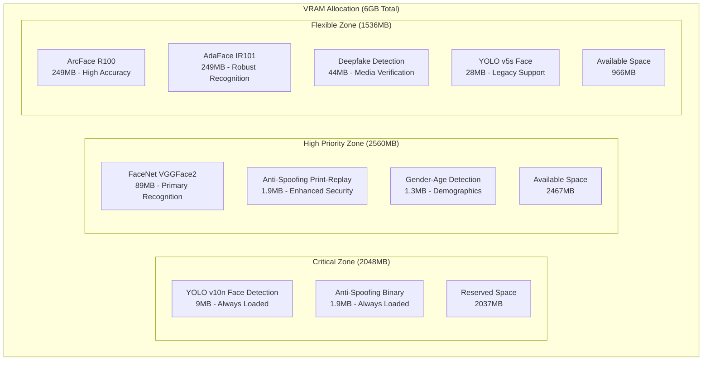

# VRAM Memory Allocation Strategy

## Intelligent GPU Memory Management for RTX 3060 Laptop

This document outlines the comprehensive VRAM allocation strategy for efficiently managing 6GB of GPU memory across multiple AI models while ensuring optimal performance and reliability.

---

## 🧠 Memory Architecture Overview

### VRAM Zone Allocation

```yaml
Total VRAM: 6144MB (6GB)

Memory Zone Distribution:
  Critical Zone:      2048MB (33.3%) - Always-loaded models
  High Priority Zone: 2560MB (41.7%) - Primary services
  Flexible Zone:      1536MB (25.0%) - Dynamic allocation
  
System Overhead:
  CUDA Context:       ~400MB
  Framework Overhead: ~200MB
  Buffer Space:       ~200MB
  Total Overhead:     ~800MB
  
Available for Models: 5344MB
```

### Memory Zone Characteristics



---

## 🎯 Model Priority Matrix

### Priority Classification System

| Priority | Zone | Characteristics | Eviction Policy | Fallback Strategy |
|----------|------|----------------|-----------------|-------------------|
| **Critical** | Critical | Never evicted, always available | None | System failure |
| **High** | High Priority | LRU eviction only under pressure | Reluctant | Optimized CPU |
| **Medium** | Flexible | Moderate eviction, usage-based | Standard LRU | Standard CPU |
| **Low** | Flexible | Aggressive eviction | Immediate | CPU preferred |

### Model Inventory with Memory Requirements

```yaml
Face Detection Models:
  yolov10n-face.onnx:
    Size: 9MB
    Priority: Critical
    Zone: Critical
    Load Time: 50ms
    Fallback: MediaPipe CPU
    Always Loaded: true
    
  yolov5s-face.onnx:
    Size: 28MB
    Priority: Low
    Zone: Flexible
    Load Time: 100ms
    Fallback: MediaPipe CPU
    Always Loaded: false

Face Recognition Models:
  facenet_vggface2.onnx:
    Size: 89MB
    Priority: High
    Zone: High Priority
    Load Time: 200ms
    Fallback: CPU version (optimized)
    Always Loaded: false
    
  arcface_r100.onnx:
    Size: 249MB
    Priority: Medium
    Zone: Flexible
    Load Time: 600ms
    Fallback: CPU version
    Always Loaded: false
    
  adaface_ir101.onnx:
    Size: 249MB
    Priority: Medium
    Zone: Flexible
    Load Time: 600ms
    Fallback: CPU version
    Always Loaded: false

Anti-Spoofing Models:
  AntiSpoofing_bin_1.5_128.onnx:
    Size: 1.9MB
    Priority: Critical
    Zone: Critical
    Load Time: 30ms
    Fallback: None (security critical)
    Always Loaded: true
    
  AntiSpoofing_print-replay_1.5_128.onnx:
    Size: 1.9MB
    Priority: High
    Zone: High Priority
    Load Time: 30ms
    Fallback: None (security critical)
    Always Loaded: false

Other Models:
  deepfake-detection/model.onnx:
    Size: 44MB
    Priority: Low
    Zone: Flexible
    Load Time: 150ms
    Fallback: CPU version
    Always Loaded: false
    
  gender-age/genderage.onnx:
    Size: 1.3MB
    Priority: Medium
    Zone: High Priority
    Load Time: 40ms
    Fallback: CPU version
    Always Loaded: false
```

---

## ⚡ Dynamic Allocation Algorithm

### Core Allocation Strategy

```python
class VRAMAllocationStrategy:
    """
    Intelligent VRAM allocation with priority-based loading and LRU eviction
    """
    
    def __init__(self):
        self.zones = {
            'critical': {
                'capacity': 2048,  # MB
                'used': 0,
                'models': {},
                'eviction_policy': 'never'
            },
            'high_priority': {
                'capacity': 2560,  # MB
                'used': 0,
                'models': {},
                'eviction_policy': 'reluctant_lru'
            },
            'flexible': {
                'capacity': 1536,  # MB
                'used': 0,
                'models': {},
                'eviction_policy': 'aggressive_lru'
            }
        }
        
        self.model_metadata = self._load_model_metadata()
        self.usage_tracker = ModelUsageTracker()
        
    async def request_model_allocation(self, 
                                     model_name: str, 
                                     priority: str,
                                     requested_by: str) -> AllocationResult:
        """
        Main allocation logic with intelligent memory management
        """
        model_info = self.model_metadata[model_name]
        target_zone = self._determine_target_zone(model_info, priority)
        
        # Check if model is already loaded
        if self._is_model_loaded(model_name):
            self._update_model_access(model_name)
            return AllocationResult(
                success=True, 
                location='gpu',
                zone=target_zone,
                action='access_existing'
            )
        
        # Try to allocate in target zone
        allocation_result = await self._try_zone_allocation(
            model_name, target_zone
        )
        
        if allocation_result.success:
            return allocation_result
        
        # Try alternative zones
        for zone_name in self._get_alternative_zones(target_zone):
            allocation_result = await self._try_zone_allocation(
                model_name, zone_name
            )
            if allocation_result.success:
                return allocation_result
        
        # Attempt eviction-based allocation
        eviction_result = await self._eviction_based_allocation(
            model_name, target_zone
        )
        
        if eviction_result.success:
            return eviction_result
        
        # Fall back to CPU
        return AllocationResult(
            success=True,
            location='cpu',
            action='cpu_fallback',
            reason='insufficient_vram'
        )
    
    async def _try_zone_allocation(self, 
                                 model_name: str, 
                                 zone_name: str) -> AllocationResult:
        """
        Attempt to allocate model in specific zone
        """
        zone = self.zones[zone_name]
        model_info = self.model_metadata[model_name]
        required_memory = model_info['vram_size']
        
        if zone['used'] + required_memory <= zone['capacity']:
            # Sufficient space available
            await self._load_model_to_zone(model_name, zone_name)
            return AllocationResult(
                success=True,
                location='gpu',
                zone=zone_name,
                action='direct_allocation'
            )
        
        return AllocationResult(success=False, reason='insufficient_space')
    
    async def _eviction_based_allocation(self, 
                                       model_name: str, 
                                       target_zone: str) -> AllocationResult:
        """
        Attempt allocation through strategic eviction
        """
        model_info = self.model_metadata[model_name]
        required_memory = model_info['vram_size']
        
        # Find eviction candidates
        eviction_candidates = self._find_eviction_candidates(
            target_zone, required_memory
        )
        
        if not eviction_candidates:
            return AllocationResult(success=False, reason='no_eviction_candidates')
        
        # Perform eviction
        for candidate in eviction_candidates:
            await self._evict_model(candidate['model_name'], candidate['zone'])
            
            # Check if we have enough space now
            if self._check_zone_capacity(target_zone, required_memory):
                await self._load_model_to_zone(model_name, target_zone)
                return AllocationResult(
                    success=True,
                    location='gpu',
                    zone=target_zone,
                    action='eviction_based_allocation',
                    evicted_models=[c['model_name'] for c in eviction_candidates]
                )
        
        return AllocationResult(success=False, reason='eviction_insufficient')
```

### LRU Eviction Implementation

```python
class LRUEvictionManager:
    """
    Least Recently Used eviction with priority awareness
    """
    
    def __init__(self):
        self.access_times = {}
        self.access_counts = {}
        self.priority_weights = {
            'critical': float('inf'),  # Never evict
            'high': 1000,
            'medium': 100,
            'low': 10
        }
    
    def calculate_eviction_score(self, model_name: str) -> float:
        """
        Calculate eviction score (lower = more likely to evict)
        """
        model_info = self.model_metadata[model_name]
        priority_weight = self.priority_weights[model_info['priority']]
        
        # Time since last access (seconds)
        last_access = self.access_times.get(model_name, 0)
        time_since_access = time.time() - last_access
        
        # Access frequency
        access_count = self.access_counts.get(model_name, 0)
        
        # Memory efficiency (smaller models easier to reload)
        memory_size = model_info['vram_size']
        load_time = model_info['load_time']
        
        # Combined score (lower = more likely to evict)
        score = priority_weight * (access_count + 1) / (time_since_access + 1)
        score *= (1000 / memory_size)  # Prefer evicting larger models
        score *= (100 / load_time)     # Account for reload cost
        
        return score
    
    def find_eviction_candidates(self, 
                               zone_name: str, 
                               required_memory: int) -> List[EvictionCandidate]:
        """
        Find optimal models to evict to free required memory
        """
        zone = self.zones[zone_name]
        candidates = []
        
        # Get all models in zone with eviction scores
        for model_name in zone['models']:
            if self._can_evict_model(model_name, zone_name):
                score = self.calculate_eviction_score(model_name)
                candidates.append(EvictionCandidate(
                    model_name=model_name,
                    zone=zone_name,
                    memory_size=self.model_metadata[model_name]['vram_size'],
                    eviction_score=score
                ))
        
        # Sort by eviction score (ascending - lowest first)
        candidates.sort(key=lambda x: x.eviction_score)
        
        # Find minimal set that frees enough memory
        selected_candidates = []
        freed_memory = 0
        
        for candidate in candidates:
            selected_candidates.append(candidate)
            freed_memory += candidate.memory_size
            
            if freed_memory >= required_memory:
                break
        
        return selected_candidates
```

---

## 🔄 Model Lifecycle Management

### Loading Strategy

```python
class ModelLifecycleManager:
    """
    Manages complete model lifecycle from loading to eviction
    """
    
    async def load_model(self, 
                        model_name: str, 
                        device: str = "cuda",
                        zone: str = None) -> LoadResult:
        """
        Load model with proper error handling and fallback
        """
        model_info = self.model_metadata[model_name]
        
        try:
            # Pre-loading validation
            await self._validate_model_file(model_name)
            
            # Memory allocation
            if device == "cuda":
                allocation = await self.vram_manager.request_model_allocation(
                    model_name, model_info['priority'], 'system'
                )
                
                if allocation.location == 'cpu':
                    device = 'cpu'
            
            # Model loading
            start_time = time.time()
            
            if device == "cuda":
                model = await self._load_model_gpu(model_name, allocation.zone)
            else:
                model = await self._load_model_cpu(model_name)
            
            load_time = time.time() - start_time
            
            # Register loaded model
            self._register_loaded_model(model_name, device, zone, model)
            
            # Update metrics
            self.metrics.record_model_load(
                model_name, device, load_time, success=True
            )
            
            return LoadResult(
                success=True,
                device=device,
                zone=zone,
                load_time=load_time,
                model=model
            )
            
        except Exception as e:
            logger.error(f"Failed to load model {model_name}: {e}")
            
            # Attempt CPU fallback if GPU failed
            if device == "cuda" and model_info.get('cpu_fallback'):
                return await self.load_model(model_name, device="cpu")
            
            self.metrics.record_model_load(
                model_name, device, 0, success=False, error=str(e)
            )
            
            return LoadResult(success=False, error=str(e))
    
    async def unload_model(self, model_name: str) -> UnloadResult:
        """
        Safely unload model and free memory
        """
        if model_name not in self.loaded_models:
            return UnloadResult(
                success=False, 
                error=f"Model {model_name} not loaded"
            )
        
        model_info = self.loaded_models[model_name]
        
        try:
            # Clear model from memory
            if model_info['device'] == 'cuda':
                await self._unload_model_gpu(model_name)
            else:
                await self._unload_model_cpu(model_name)
            
            # Update VRAM allocation
            if model_info['zone']:
                self.vram_manager.release_zone_memory(
                    model_info['zone'], 
                    self.model_metadata[model_name]['vram_size']
                )
            
            # Unregister model
            del self.loaded_models[model_name]
            
            # Update metrics
            self.metrics.record_model_unload(model_name, success=True)
            
            return UnloadResult(success=True)
            
        except Exception as e:
            logger.error(f"Failed to unload model {model_name}: {e}")
            self.metrics.record_model_unload(
                model_name, success=False, error=str(e)
            )
            return UnloadResult(success=False, error=str(e))
```

### Preemptive Loading Strategy

```python
class PreemptiveLoadingManager:
    """
    Intelligent preemptive loading based on usage patterns
    """
    
    def __init__(self):
        self.usage_predictor = UsagePredictor()
        self.load_scheduler = LoadScheduler()
    
    async def analyze_and_preload(self):
        """
        Analyze usage patterns and preload likely-needed models
        """
        # Get usage predictions
        predictions = await self.usage_predictor.predict_next_hour()
        
        # Sort by predicted probability
        predictions.sort(key=lambda x: x.probability, reverse=True)
        
        for prediction in predictions:
            model_name = prediction.model_name
            probability = prediction.probability
            
            # Only preload if high probability and not already loaded
            if probability > 0.7 and not self._is_model_loaded(model_name):
                
                # Check if we have available capacity
                model_info = self.model_metadata[model_name]
                target_zone = self._get_target_zone(model_info)
                
                if self._has_zone_capacity(target_zone, model_info['vram_size']):
                    await self.load_model(model_name, zone=target_zone)
                    logger.info(
                        f"Preloaded {model_name} based on usage prediction "
                        f"(probability: {probability:.2f})"
                    )
```

---

## 📊 Memory Monitoring and Optimization

### Real-time Memory Tracking

```python
class VRAMMonitor:
    """
    Real-time VRAM monitoring and optimization
    """
    
    def __init__(self):
        self.monitoring_interval = 5  # seconds
        self.optimization_threshold = 0.85  # 85% usage triggers optimization
        
    async def start_monitoring(self):
        """
        Start continuous VRAM monitoring
        """
        while True:
            try:
                memory_status = await self._get_memory_status()
                await self._update_metrics(memory_status)
                
                # Check for optimization triggers
                if memory_status.utilization > self.optimization_threshold:
                    await self._trigger_optimization()
                
                # Check for memory pressure
                if memory_status.available_mb < 200:
                    await self._handle_memory_pressure()
                
                await asyncio.sleep(self.monitoring_interval)
                
            except Exception as e:
                logger.error(f"Memory monitoring error: {e}")
                await asyncio.sleep(self.monitoring_interval)
    
    async def _get_memory_status(self) -> MemoryStatus:
        """
        Get current GPU memory status
        """
        try:
            # Get GPU memory info
            gpu_memory = torch.cuda.memory_stats()
            
            total_memory = torch.cuda.get_device_properties(0).total_memory
            allocated_memory = torch.cuda.memory_allocated(0)
            reserved_memory = torch.cuda.memory_reserved(0)
            
            # Calculate zone usage
            zone_usage = {}
            for zone_name, zone in self.zones.items():
                zone_usage[zone_name] = {
                    'used_mb': zone['used'],
                    'capacity_mb': zone['capacity'],
                    'utilization': zone['used'] / zone['capacity'],
                    'model_count': len(zone['models'])
                }
            
            return MemoryStatus(
                total_mb=total_memory // (1024 * 1024),
                allocated_mb=allocated_memory // (1024 * 1024),
                reserved_mb=reserved_memory // (1024 * 1024),
                available_mb=(total_memory - reserved_memory) // (1024 * 1024),
                utilization=reserved_memory / total_memory,
                zone_usage=zone_usage,
                fragmentation=self._calculate_fragmentation()
            )
            
        except Exception as e:
            logger.error(f"Failed to get memory status: {e}")
            return MemoryStatus(error=str(e))
    
    async def _trigger_optimization(self):
        """
        Trigger memory optimization when utilization is high
        """
        logger.info("High VRAM utilization detected, triggering optimization")
        
        # Find optimization opportunities
        optimization_actions = await self._analyze_optimization_opportunities()
        
        for action in optimization_actions:
            try:
                await self._execute_optimization_action(action)
            except Exception as e:
                logger.error(f"Optimization action failed: {e}")
    
    async def _analyze_optimization_opportunities(self) -> List[OptimizationAction]:
        """
        Analyze current state and suggest optimization actions
        """
        actions = []
        
        # Find unused models (not accessed recently)
        current_time = time.time()
        for model_name, last_access in self.access_times.items():
            if current_time - last_access > 300:  # 5 minutes
                model_info = self.loaded_models.get(model_name)
                if model_info and model_info['device'] == 'cuda':
                    priority = self.model_metadata[model_name]['priority']
                    if priority in ['low', 'medium']:
                        actions.append(OptimizationAction(
                            type='unload_unused',
                            model_name=model_name,
                            expected_memory_freed=self.model_metadata[model_name]['vram_size'],
                            priority=priority
                        ))
        
        # Sort by memory impact
        actions.sort(key=lambda x: x.expected_memory_freed, reverse=True)
        
        return actions
```

### Memory Defragmentation

```python
class MemoryDefragmenter:
    """
    Handle VRAM fragmentation issues
    """
    
    async def defragment_memory(self) -> DefragmentationResult:
        """
        Defragment VRAM by strategic model reloading
        """
        logger.info("Starting VRAM defragmentation")
        
        # Get current memory layout
        memory_layout = await self._analyze_memory_layout()
        
        if memory_layout.fragmentation_ratio < 0.3:
            return DefragmentationResult(
                success=True, 
                action='no_action_needed',
                fragmentation_before=memory_layout.fragmentation_ratio
            )
        
        # Plan defragmentation strategy
        defrag_plan = await self._create_defragmentation_plan(memory_layout)
        
        # Execute defragmentation
        try:
            await self._execute_defragmentation_plan(defrag_plan)
            
            # Verify improvement
            new_layout = await self._analyze_memory_layout()
            
            return DefragmentationResult(
                success=True,
                action='defragmentation_completed',
                fragmentation_before=memory_layout.fragmentation_ratio,
                fragmentation_after=new_layout.fragmentation_ratio,
                memory_freed=new_layout.available_mb - memory_layout.available_mb
            )
            
        except Exception as e:
            logger.error(f"Defragmentation failed: {e}")
            return DefragmentationResult(
                success=False,
                error=str(e)
            )
```

---

## 🎛️ Configuration and Tuning

### Performance Tuning Parameters

```yaml
# config/vram_config.yaml
vram_management:
  total_memory_mb: 6144
  
  zones:
    critical:
      size_mb: 2048
      reserved_models:
        - yolov10n-face.onnx
        - AntiSpoofing_bin_1.5_128.onnx
      eviction_policy: never
      
    high_priority:
      size_mb: 2560
      max_models: 5
      eviction_policy: reluctant_lru
      min_retention_time: 300  # 5 minutes
      
    flexible:
      size_mb: 1536
      max_models: 10
      eviction_policy: aggressive_lru
      min_retention_time: 60   # 1 minute

  optimization:
    monitoring_interval: 5
    optimization_threshold: 0.85
    defragmentation_threshold: 0.3
    preload_prediction_threshold: 0.7
    
  fallback:
    cpu_fallback_enabled: true
    cpu_performance_ratio: 0.3  # CPU is 30% of GPU speed
    fallback_queue_size: 100
    
  caching:
    result_cache_size: 1000
    cache_ttl: 3600  # 1 hour
    enable_result_caching: true
```

### Model-Specific Configuration

```yaml
# config/model_config.yaml
models:
  face_detection:
    yolov10n-face.onnx:
      priority: critical
      vram_size_mb: 9
      load_time_ms: 50
      cpu_fallback: mediapipe
      always_loaded: true
      performance_multiplier: 1.0
      
    yolov5s-face.onnx:
      priority: low
      vram_size_mb: 28
      load_time_ms: 100
      cpu_fallback: mediapipe
      always_loaded: false
      performance_multiplier: 1.2

  face_recognition:
    facenet_vggface2.onnx:
      priority: high
      vram_size_mb: 89
      load_time_ms: 200
      cpu_fallback: cpu_optimized
      always_loaded: false
      performance_multiplier: 1.0
      batch_size: 32
      
    arcface_r100.onnx:
      priority: medium
      vram_size_mb: 249
      load_time_ms: 600
      cpu_fallback: cpu_standard
      always_loaded: false
      performance_multiplier: 1.3
      batch_size: 16
      
    adaface_ir101.onnx:
      priority: medium
      vram_size_mb: 249
      load_time_ms: 600
      cpu_fallback: cpu_standard
      always_loaded: false
      performance_multiplier: 1.4
      batch_size: 16

  anti_spoofing:
    AntiSpoofing_bin_1.5_128.onnx:
      priority: critical
      vram_size_mb: 1.9
      load_time_ms: 30
      cpu_fallback: none
      always_loaded: true
      performance_multiplier: 1.0
      
    AntiSpoofing_print-replay_1.5_128.onnx:
      priority: high
      vram_size_mb: 1.9
      load_time_ms: 30
      cpu_fallback: none
      always_loaded: false
      performance_multiplier: 1.0

  deepfake_detection:
    model.onnx:
      priority: low
      vram_size_mb: 44
      load_time_ms: 150
      cpu_fallback: cpu_standard
      always_loaded: false
      performance_multiplier: 1.5
      
  gender_age:
    genderage.onnx:
      priority: medium
      vram_size_mb: 1.3
      load_time_ms: 40
      cpu_fallback: cpu_optimized
      always_loaded: false
      performance_multiplier: 1.0
```

---

*This VRAM allocation strategy ensures optimal utilization of GPU memory while providing intelligent fallback mechanisms and dynamic optimization for the RTX 3060 Laptop hardware constraints.*
