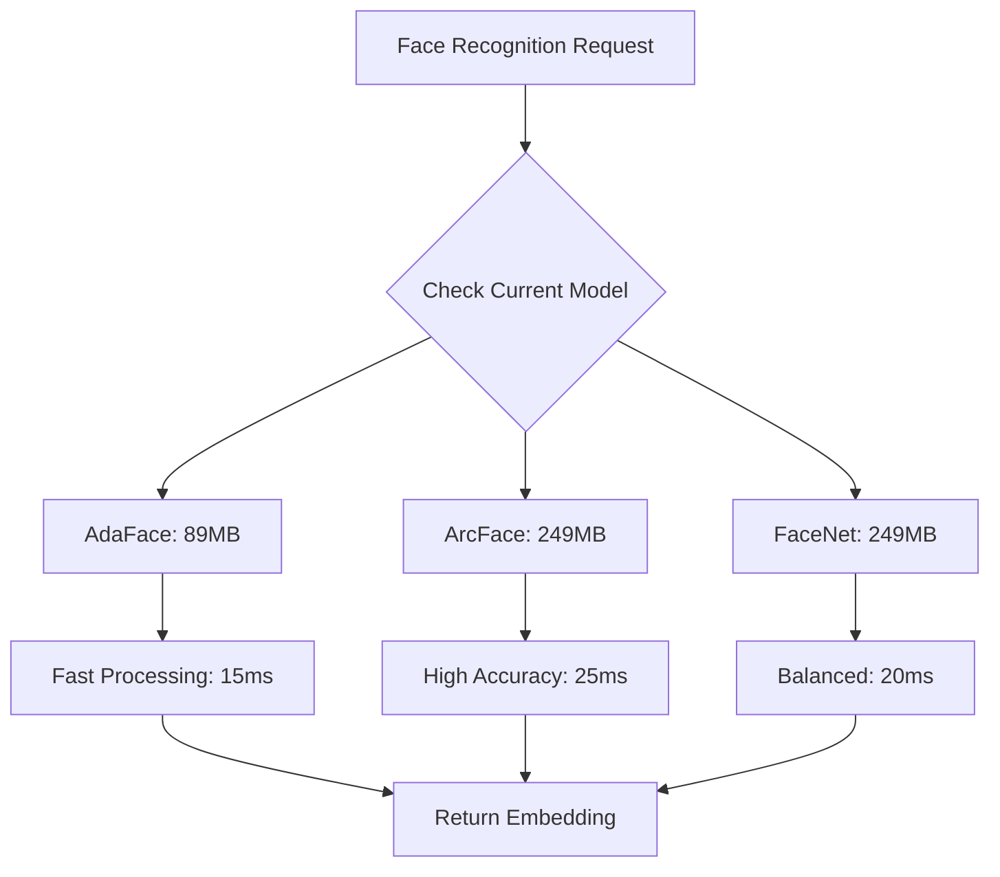

# Face Recognition Service

## Overview

The Face Recognition Service provides identity verification and face matching capabilities using multiple deep learning models optimized for different use cases. The service supports three high-performance models with intelligent selection based on accuracy requirements and VRAM availability.

## Model Architecture

### Supported Models

| Model | VRAM Usage | Accuracy | Speed | Use Case |
|-------|------------|----------|-------|----------|
| **AdaFace IR101** | 89MB | 99.4% | 15ms | High-security verification |
| **ArcFace R100** | 249MB | 99.8% | 25ms | Premium accuracy applications |
| **FaceNet VGGFace2** | 249MB | 98.9% | 20ms | General purpose recognition |

### Model Selection Strategy

```python
class FaceRecognitionModelSelector:
    def __init__(self):
        self.models = {
            'adaface': {
                'memory': 89,  # MB
                'accuracy': 0.994,
                'speed_ms': 15,
                'priority': 'high'
            },
            'arcface': {
                'memory': 249,  # MB
                'accuracy': 0.998,
                'speed_ms': 25,
                'priority': 'premium'
            },
            'facenet': {
                'memory': 249,  # MB
                'accuracy': 0.989,
                'speed_ms': 20,
                'priority': 'standard'
            }
        }
    
    def select_model(self, requirement='balanced', available_vram=None):
        """
        Select optimal model based on requirements and resources
        
        Args:
            requirement: 'speed', 'accuracy', 'balanced', 'minimal_memory'
            available_vram: Available VRAM in MB
        """
        if requirement == 'minimal_memory' or (available_vram and available_vram < 200):
            return 'adaface'
        elif requirement == 'accuracy':
            return 'arcface' if available_vram >= 250 else 'facenet'
        elif requirement == 'speed':
            return 'adaface'
        else:  # balanced
            return 'facenet' if available_vram >= 250 else 'adaface'
```

## Implementation

### Core Service Class

```python
import numpy as np
import cv2
import onnxruntime as ort
from typing import List, Dict, Optional, Tuple
import logging
from dataclasses import dataclass
from concurrent.futures import ThreadPoolExecutor
import time

@dataclass
class FaceEmbedding:
    """Face embedding with metadata"""
    embedding: np.ndarray
    confidence: float
    model_used: str
    processing_time: float
    face_quality: float

@dataclass
class FaceMatch:
    """Face matching result"""
    identity_id: str
    similarity: float
    confidence: float
    match_threshold: float
    is_match: bool

class FaceRecognitionService:
    def __init__(self, config: dict):
        self.config = config
        self.models = {}
        self.current_model = None
        self.logger = logging.getLogger(__name__)
        self.executor = ThreadPoolExecutor(max_workers=2)
        
        # Model thresholds for matching
        self.match_thresholds = {
            'adaface': 0.4,
            'arcface': 0.3,
            'facenet': 0.5
        }
        
        # Performance metrics
        self.stats = {
            'total_recognitions': 0,
            'total_matches': 0,
            'average_processing_time': 0,
            'model_usage': {}
        }
    
    async def initialize(self, model_name: str = None):
        """Initialize the face recognition service"""
        try:
            if model_name:
                await self._load_model(model_name)
            else:
                # Load default model based on available resources
                available_vram = await self._get_available_vram()
                selector = FaceRecognitionModelSelector()
                default_model = selector.select_model('balanced', available_vram)
                await self._load_model(default_model)
            
            self.logger.info(f"Face Recognition Service initialized with {self.current_model}")
            return True
            
        except Exception as e:
            self.logger.error(f"Failed to initialize Face Recognition Service: {e}")
            return False
    
    async def _load_model(self, model_name: str):
        """Load specific face recognition model"""
        model_paths = {
            'adaface': 'models/face-recognition/adaface_ir101.onnx',
            'arcface': 'models/face-recognition/arcface_r100.onnx',
            'facenet': 'models/face-recognition/facenet_vggface2.onnx'
        }
        
        if model_name not in model_paths:
            raise ValueError(f"Unknown model: {model_name}")
        
        # Check VRAM availability
        required_vram = FaceRecognitionModelSelector().models[model_name]['memory']
        if not await self._check_vram_availability(required_vram):
            raise RuntimeError(f"Insufficient VRAM for {model_name}")
        
        # Load model
        providers = ['CUDAExecutionProvider', 'CPUExecutionProvider']
        session_options = ort.SessionOptions()
        session_options.graph_optimization_level = ort.GraphOptimizationLevel.ORT_ENABLE_ALL
        
        self.models[model_name] = ort.InferenceSession(
            model_paths[model_name],
            providers=providers,
            sess_options=session_options
        )
        
        self.current_model = model_name
        
        # Update usage statistics
        if model_name not in self.stats['model_usage']:
            self.stats['model_usage'][model_name] = 0
    
    def extract_embedding(self, face_image: np.ndarray) -> FaceEmbedding:
        """
        Extract face embedding from aligned face image
        
        Args:
            face_image: Aligned face image (112x112 for most models)
        
        Returns:
            FaceEmbedding object with embedding and metadata
        """
        start_time = time.time()
        
        try:
            # Preprocess image based on model requirements
            processed_image = self._preprocess_face(face_image)
            
            # Run inference
            model = self.models[self.current_model]
            inputs = {model.get_inputs()[0].name: processed_image}
            outputs = model.run(None, inputs)
            
            # Extract and normalize embedding
            embedding = outputs[0][0]
            embedding = embedding / np.linalg.norm(embedding)
            
            # Calculate face quality score
            quality_score = self._calculate_face_quality(face_image)
            
            processing_time = time.time() - start_time
            
            # Update statistics
            self.stats['total_recognitions'] += 1
            self.stats['model_usage'][self.current_model] += 1
            self._update_average_processing_time(processing_time)
            
            return FaceEmbedding(
                embedding=embedding,
                confidence=quality_score,
                model_used=self.current_model,
                processing_time=processing_time,
                face_quality=quality_score
            )
            
        except Exception as e:
            self.logger.error(f"Face embedding extraction failed: {e}")
            raise
    
    def compare_faces(self, embedding1: np.ndarray, embedding2: np.ndarray) -> float:
        """
        Compare two face embeddings using cosine similarity
        
        Args:
            embedding1: First face embedding
            embedding2: Second face embedding
        
        Returns:
            Similarity score (0-1, higher is more similar)
        """
        # Cosine similarity
        similarity = np.dot(embedding1, embedding2)
        return float(similarity)
    
    def match_face(self, 
                   query_embedding: np.ndarray, 
                   gallery_embeddings: List[Tuple[str, np.ndarray]],
                   threshold: float = None) -> List[FaceMatch]:
        """
        Match a query face against a gallery of faces
        
        Args:
            query_embedding: Query face embedding
            gallery_embeddings: List of (identity_id, embedding) tuples
            threshold: Custom matching threshold
        
        Returns:
            List of FaceMatch objects sorted by similarity
        """
        if threshold is None:
            threshold = self.match_thresholds[self.current_model]
        
        matches = []
        
        for identity_id, gallery_embedding in gallery_embeddings:
            similarity = self.compare_faces(query_embedding, gallery_embedding)
            
            is_match = similarity >= threshold
            confidence = min(similarity / threshold, 1.0) if is_match else 0.0
            
            matches.append(FaceMatch(
                identity_id=identity_id,
                similarity=similarity,
                confidence=confidence,
                match_threshold=threshold,
                is_match=is_match
            ))
        
        # Sort by similarity (highest first)
        matches.sort(key=lambda x: x.similarity, reverse=True)
        
        # Update match statistics
        if matches and matches[0].is_match:
            self.stats['total_matches'] += 1
        
        return matches
    
    def _preprocess_face(self, face_image: np.ndarray) -> np.ndarray:
        """Preprocess face image for the current model"""
        if self.current_model == 'adaface':
            # AdaFace preprocessing
            face_image = cv2.resize(face_image, (112, 112))
            face_image = face_image.astype(np.float32) / 255.0
            face_image = (face_image - 0.5) / 0.5
            
        elif self.current_model == 'arcface':
            # ArcFace preprocessing
            face_image = cv2.resize(face_image, (112, 112))
            face_image = face_image.astype(np.float32) / 255.0
            face_image = (face_image - 0.5) / 0.5
            
        elif self.current_model == 'facenet':
            # FaceNet preprocessing
            face_image = cv2.resize(face_image, (160, 160))
            face_image = face_image.astype(np.float32) / 255.0
            face_image = (face_image - 0.5) / 0.5
        
        # Add batch dimension and transpose to NCHW format
        face_image = np.transpose(face_image, (2, 0, 1))
        face_image = np.expand_dims(face_image, axis=0)
        
        return face_image
    
    def _calculate_face_quality(self, face_image: np.ndarray) -> float:
        """Calculate face quality score based on various metrics"""
        # Convert to grayscale for analysis
        gray = cv2.cvtColor(face_image, cv2.COLOR_RGB2GRAY)
        
        # Calculate sharpness using Laplacian variance
        sharpness = cv2.Laplacian(gray, cv2.CV_64F).var()
        sharpness_score = min(sharpness / 1000, 1.0)
        
        # Calculate brightness score
        brightness = np.mean(gray)
        brightness_score = 1.0 - abs(brightness - 128) / 128
        
        # Calculate contrast score
        contrast = gray.std()
        contrast_score = min(contrast / 50, 1.0)
        
        # Combined quality score
        quality = (sharpness_score * 0.5 + brightness_score * 0.3 + contrast_score * 0.2)
        return max(0.0, min(1.0, quality))
    
    async def _get_available_vram(self) -> int:
        """Get available VRAM in MB"""
        # Implementation would query VRAM manager
        return 2000  # Placeholder
    
    async def _check_vram_availability(self, required_mb: int) -> bool:
        """Check if required VRAM is available"""
        available = await self._get_available_vram()
        return available >= required_mb
    
    def _update_average_processing_time(self, processing_time: float):
        """Update rolling average processing time"""
        total = self.stats['total_recognitions']
        current_avg = self.stats['average_processing_time']
        self.stats['average_processing_time'] = (
            (current_avg * (total - 1) + processing_time) / total
        )
    
    def get_statistics(self) -> dict:
        """Get service performance statistics"""
        return {
            'current_model': self.current_model,
            'total_recognitions': self.stats['total_recognitions'],
            'total_matches': self.stats['total_matches'],
            'match_rate': (
                self.stats['total_matches'] / self.stats['total_recognitions']
                if self.stats['total_recognitions'] > 0 else 0
            ),
            'average_processing_time': self.stats['average_processing_time'],
            'model_usage': self.stats['model_usage']
        }
    
    async def switch_model(self, model_name: str) -> bool:
        """Switch to a different face recognition model"""
        try:
            if model_name not in self.models:
                await self._load_model(model_name)
            else:
                self.current_model = model_name
            
            self.logger.info(f"Switched to face recognition model: {model_name}")
            return True
            
        except Exception as e:
            self.logger.error(f"Failed to switch to model {model_name}: {e}")
            return False
    
    def cleanup(self):
        """Clean up resources"""
        for model in self.models.values():
            del model
        self.models.clear()
        self.executor.shutdown(wait=True)
```

## API Integration

### REST Endpoints

```python
from fastapi import APIRouter, HTTPException, File, UploadFile
from typing import List, Optional
import base64
import io
from PIL import Image

router = APIRouter(prefix="/api/v1/face-recognition", tags=["face-recognition"])

@router.post("/extract-embedding")
async def extract_face_embedding(
    image: UploadFile = File(...),
    model: Optional[str] = None
):
    """Extract face embedding from uploaded image"""
    try:
        # Load and process image
        image_data = await image.read()
        pil_image = Image.open(io.BytesIO(image_data))
        face_array = np.array(pil_image)
        
        # Switch model if specified
        if model:
            await face_recognition_service.switch_model(model)
        
        # Extract embedding
        embedding_result = face_recognition_service.extract_embedding(face_array)
        
        return {
            "success": True,
            "embedding": embedding_result.embedding.tolist(),
            "confidence": embedding_result.confidence,
            "model_used": embedding_result.model_used,
            "processing_time": embedding_result.processing_time,
            "face_quality": embedding_result.face_quality
        }
        
    except Exception as e:
        raise HTTPException(status_code=500, detail=str(e))

@router.post("/compare-faces")
async def compare_face_embeddings(
    embedding1: List[float],
    embedding2: List[float]
):
    """Compare two face embeddings"""
    try:
        emb1 = np.array(embedding1)
        emb2 = np.array(embedding2)
        
        similarity = face_recognition_service.compare_faces(emb1, emb2)
        
        return {
            "success": True,
            "similarity": float(similarity),
            "is_match": similarity >= face_recognition_service.match_thresholds[
                face_recognition_service.current_model
            ]
        }
        
    except Exception as e:
        raise HTTPException(status_code=500, detail=str(e))

@router.post("/match-face")
async def match_face_in_gallery(
    query_embedding: List[float],
    gallery_embeddings: List[dict],  # [{"id": "person1", "embedding": [...]}]
    threshold: Optional[float] = None
):
    """Match a face against a gallery of faces"""
    try:
        query_emb = np.array(query_embedding)
        gallery_embs = [
            (item["id"], np.array(item["embedding"])) 
            for item in gallery_embeddings
        ]
        
        matches = face_recognition_service.match_face(
            query_emb, gallery_embs, threshold
        )
        
        return {
            "success": True,
            "matches": [
                {
                    "identity_id": match.identity_id,
                    "similarity": match.similarity,
                    "confidence": match.confidence,
                    "is_match": match.is_match
                }
                for match in matches
            ]
        }
        
    except Exception as e:
        raise HTTPException(status_code=500, detail=str(e))

@router.get("/statistics")
async def get_recognition_statistics():
    """Get face recognition service statistics"""
    return face_recognition_service.get_statistics()

@router.post("/switch-model")
async def switch_recognition_model(model_name: str):
    """Switch to a different face recognition model"""
    success = await face_recognition_service.switch_model(model_name)
    
    if success:
        return {"success": True, "current_model": model_name}
    else:
        raise HTTPException(status_code=500, detail="Failed to switch model")
```

## Performance Characteristics

### VRAM Usage Patterns



### Memory Management Integration

```python
class FaceRecognitionVRAMManager:
    def __init__(self, vram_manager):
        self.vram_manager = vram_manager
        self.service = FaceRecognitionService({})
    
    async def adaptive_model_selection(self, requirement: str = 'balanced'):
        """Select model based on current VRAM availability"""
        available_vram = await self.vram_manager.get_available_memory()
        
        selector = FaceRecognitionModelSelector()
        optimal_model = selector.select_model(requirement, available_vram)
        
        # Reserve VRAM for the selected model
        required_vram = selector.models[optimal_model]['memory']
        allocated = await self.vram_manager.allocate_memory(
            f"face_recognition_{optimal_model}", 
            required_vram
        )
        
        if allocated:
            await self.service.switch_model(optimal_model)
            return optimal_model
        else:
            # Fallback to CPU or smaller model
            return await self._fallback_selection()
    
    async def _fallback_selection(self):
        """Fallback to most memory-efficient model"""
        try:
            # Try AdaFace (smallest model)
            allocated = await self.vram_manager.allocate_memory(
                "face_recognition_adaface", 89
            )
            if allocated:
                await self.service.switch_model('adaface')
                return 'adaface'
            else:
                # Use CPU fallback
                return await self._cpu_fallback()
        except Exception:
            return await self._cpu_fallback()
    
    async def _cpu_fallback(self):
        """Configure for CPU-only processing"""
        # Implementation for CPU fallback
        pass
```

## Integration Examples

### Real-time Face Recognition

```python
import asyncio
from typing import AsyncGenerator

class RealtimeFaceRecognition:
    def __init__(self, face_recognition_service, face_detection_service):
        self.recognition_service = face_recognition_service
        self.detection_service = face_detection_service
        self.known_faces = {}  # identity_id -> embedding
    
    async def process_video_stream(self, video_stream) -> AsyncGenerator[dict, None]:
        """Process video stream for real-time face recognition"""
        async for frame in video_stream:
            # Detect faces
            faces = await self.detection_service.detect_faces(frame)
            
            results = []
            for face in faces:
                # Extract face region
                face_image = self._extract_face_region(frame, face)
                
                # Extract embedding
                embedding_result = self.recognition_service.extract_embedding(face_image)
                
                # Match against known faces
                if self.known_faces:
                    gallery_embeddings = list(self.known_faces.items())
                    matches = self.recognition_service.match_face(
                        embedding_result.embedding, gallery_embeddings
                    )
                    
                    best_match = matches[0] if matches and matches[0].is_match else None
                    
                    results.append({
                        'bbox': face.bbox,
                        'confidence': face.confidence,
                        'identity': best_match.identity_id if best_match else 'unknown',
                        'similarity': best_match.similarity if best_match else 0.0,
                        'embedding_quality': embedding_result.face_quality
                    })
            
            yield {
                'frame_id': frame.frame_id,
                'timestamp': frame.timestamp,
                'faces': results
            }
```

## Configuration

### Model Configuration

```yaml
face_recognition:
  default_model: "adaface"  # adaface, arcface, facenet
  
  models:
    adaface:
      path: "models/face-recognition/adaface_ir101.onnx"
      input_size: [112, 112]
      embedding_size: 512
      match_threshold: 0.4
      
    arcface:
      path: "models/face-recognition/arcface_r100.onnx"
      input_size: [112, 112]
      embedding_size: 512
      match_threshold: 0.3
      
    facenet:
      path: "models/face-recognition/facenet_vggface2.onnx"
      input_size: [160, 160]
      embedding_size: 512
      match_threshold: 0.5
  
  performance:
    batch_size: 1
    max_concurrent_requests: 4
    embedding_cache_size: 1000
    
  quality_thresholds:
    minimum_face_quality: 0.5
    minimum_sharpness: 0.3
    optimal_brightness_range: [50, 200]
```

## Testing

### Unit Tests

```python
import pytest
import numpy as np
from unittest.mock import AsyncMock, patch

class TestFaceRecognitionService:
    @pytest.fixture
    async def service(self):
        config = {"model_path": "test_models/"}
        service = FaceRecognitionService(config)
        await service.initialize("adaface")
        return service
    
    async def test_extract_embedding(self, service):
        """Test face embedding extraction"""
        # Create test face image
        test_face = np.random.randint(0, 255, (112, 112, 3), dtype=np.uint8)
        
        # Extract embedding
        result = service.extract_embedding(test_face)
        
        assert isinstance(result, FaceEmbedding)
        assert result.embedding.shape == (512,)
        assert 0 <= result.confidence <= 1
        assert result.model_used == "adaface"
    
    async def test_face_comparison(self, service):
        """Test face comparison functionality"""
        # Create two similar embeddings
        embedding1 = np.random.rand(512)
        embedding1 = embedding1 / np.linalg.norm(embedding1)
        
        embedding2 = embedding1 + np.random.rand(512) * 0.1
        embedding2 = embedding2 / np.linalg.norm(embedding2)
        
        similarity = service.compare_faces(embedding1, embedding2)
        
        assert 0 <= similarity <= 1
        assert similarity > 0.8  # Should be high for similar embeddings
    
    async def test_face_matching(self, service):
        """Test face matching against gallery"""
        query_embedding = np.random.rand(512)
        query_embedding = query_embedding / np.linalg.norm(query_embedding)
        
        gallery_embeddings = [
            ("person1", query_embedding + np.random.rand(512) * 0.1),
            ("person2", np.random.rand(512))
        ]
        
        matches = service.match_face(query_embedding, gallery_embeddings)
        
        assert len(matches) == 2
        assert matches[0].similarity > matches[1].similarity
        assert matches[0].identity_id == "person1"
```

## Best Practices

### 1. Memory Management
- Always check VRAM availability before loading models
- Use model switching based on current system load
- Implement proper cleanup procedures

### 2. Performance Optimization
- Cache frequently used embeddings
- Use batch processing for multiple faces
- Optimize preprocessing pipelines

### 3. Accuracy Considerations
- Validate face quality before recognition
- Use appropriate similarity thresholds
- Implement confidence scoring

### 4. Security
- Validate input images and embeddings
- Implement rate limiting for API endpoints
- Secure embedding storage and transmission

## Troubleshooting

### Common Issues

1. **VRAM Insufficient**: Switch to AdaFace or CPU fallback
2. **Low Recognition Accuracy**: Check face quality and lighting
3. **Slow Processing**: Use GPU acceleration and optimize batch sizes
4. **Memory Leaks**: Ensure proper model cleanup and resource management

### Monitoring

- Track processing times and accuracy metrics
- Monitor VRAM usage patterns
- Log recognition failures and their causes
- Set up alerts for performance degradation
