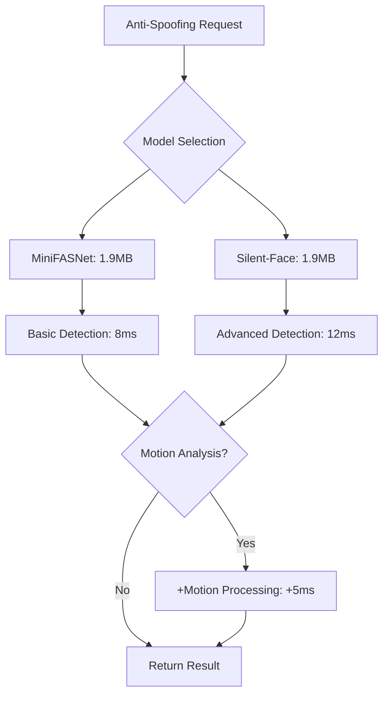

# Anti-Spoofing Service

## Overview

The Anti-Spoofing Service provides liveness detection and presentation attack detection to prevent unauthorized access using photos, videos, masks, or other spoofing attempts. The service uses multiple lightweight models optimized for real-time processing on the RTX 3060 Laptop.

## Model Architecture

### Supported Models

| Model | VRAM Usage | Accuracy | Speed | Detection Type |
|-------|------------|----------|-------|----------------|
| **MiniFASNet V2** | 1.9MB | 97.2% | 8ms | Photo/Video attacks |
| **Silent-Face** | 1.9MB | 98.1% | 12ms | Advanced spoofing |

### Detection Capabilities

```python
class AntiSpoofingDetectionTypes:
    PHOTO_ATTACK = "photo"           # Printed photos, phone/tablet displays
    VIDEO_ATTACK = "video"           # Video replay attacks
    MASK_ATTACK = "mask"             # 3D masks, deepfake masks
    SCREEN_ATTACK = "screen"         # Digital screen displays
    PAPER_ATTACK = "paper"           # High-quality prints
    LIVE_FACE = "live"               # Genuine live face
    UNKNOWN = "unknown"              # Unable to determine
    
    @classmethod
    def get_all_attack_types(cls):
        return [cls.PHOTO_ATTACK, cls.VIDEO_ATTACK, cls.MASK_ATTACK, 
                cls.SCREEN_ATTACK, cls.PAPER_ATTACK]
```

## Implementation

### Core Service Class

```python
import numpy as np
import cv2
import onnxruntime as ort
from typing import Dict, Optional, Tuple, List
import logging
from dataclasses import dataclass
from enum import Enum
import time
import asyncio

@dataclass
class AntiSpoofingResult:
    """Anti-spoofing detection result"""
    is_live: bool
    confidence: float
    attack_type: str
    liveness_score: float
    processing_time: float
    model_used: str
    face_quality: float
    motion_detected: bool

class AntiSpoofingService:
    def __init__(self, config: dict):
        self.config = config
        self.models = {}
        self.current_model = 'minifasnet'
        self.logger = logging.getLogger(__name__)
        
        # Detection thresholds
        self.thresholds = {
            'minifasnet': {
                'liveness': 0.5,
                'confidence': 0.7
            },
            'silent_face': {
                'liveness': 0.6,
                'confidence': 0.75
            }
        }
        
        # Performance statistics
        self.stats = {
            'total_detections': 0,
            'live_faces': 0,
            'spoofing_attempts': 0,
            'attack_types': {},
            'average_processing_time': 0,
            'model_usage': {}
        }
        
        # Motion detection for enhanced liveness
        self.motion_detector = None
        self.previous_frames = []
        self.max_frame_history = 5
    
    async def initialize(self, model_name: str = None):
        """Initialize the anti-spoofing service"""
        try:
            if model_name:
                await self._load_model(model_name)
            else:
                await self._load_model('minifasnet')  # Default lightweight model
            
            # Initialize motion detector
            self._initialize_motion_detector()
            
            self.logger.info(f"Anti-Spoofing Service initialized with {self.current_model}")
            return True
            
        except Exception as e:
            self.logger.error(f"Failed to initialize Anti-Spoofing Service: {e}")
            return False
    
    async def _load_model(self, model_name: str):
        """Load specific anti-spoofing model"""
        model_paths = {
            'minifasnet': 'models/anti-spoofing/minifasnet_v2.onnx',
            'silent_face': 'models/anti-spoofing/silent_face.onnx'
        }
        
        if model_name not in model_paths:
            raise ValueError(f"Unknown model: {model_name}")
        
        # Check VRAM availability (minimal for anti-spoofing models)
        required_vram = 2  # MB - very lightweight
        if not await self._check_vram_availability(required_vram):
            self.logger.warning("Low VRAM, using CPU for anti-spoofing")
        
        # Load model with GPU preference but CPU fallback
        providers = ['CUDAExecutionProvider', 'CPUExecutionProvider']
        session_options = ort.SessionOptions()
        session_options.graph_optimization_level = ort.GraphOptimizationLevel.ORT_ENABLE_ALL
        
        self.models[model_name] = ort.InferenceSession(
            model_paths[model_name],
            providers=providers,
            sess_options=session_options
        )
        
        self.current_model = model_name
        
        # Initialize usage statistics
        if model_name not in self.stats['model_usage']:
            self.stats['model_usage'][model_name] = 0
    
    def detect_spoofing(self, face_image: np.ndarray, frame_sequence: List[np.ndarray] = None) -> AntiSpoofingResult:
        """
        Detect if face is live or spoofed
        
        Args:
            face_image: Face region image
            frame_sequence: Optional sequence of frames for motion analysis
        
        Returns:
            AntiSpoofingResult with detection details
        """
        start_time = time.time()
        
        try:
            # Preprocess face image
            processed_image = self._preprocess_face(face_image)
            
            # Run anti-spoofing inference
            model = self.models[self.current_model]
            inputs = {model.get_inputs()[0].name: processed_image}
            outputs = model.run(None, inputs)
            
            # Process model outputs
            liveness_score, attack_probabilities = self._process_outputs(outputs)
            
            # Determine if face is live
            threshold = self.thresholds[self.current_model]['liveness']
            is_live = liveness_score > threshold
            
            # Identify attack type if spoofed
            attack_type = self._identify_attack_type(attack_probabilities) if not is_live else "live"
            
            # Calculate confidence
            confidence = self._calculate_confidence(liveness_score, attack_probabilities)
            
            # Analyze motion if frame sequence provided
            motion_detected = self._analyze_motion(frame_sequence) if frame_sequence else False
            
            # Calculate face quality
            face_quality = self._calculate_face_quality(face_image)
            
            # Adjust results based on motion analysis
            if frame_sequence and not motion_detected and is_live:
                # Reduce confidence if no motion detected for "live" face
                confidence *= 0.7
                if confidence < self.thresholds[self.current_model]['confidence']:
                    is_live = False
                    attack_type = "photo"
            
            processing_time = time.time() - start_time
            
            # Update statistics
            self._update_statistics(is_live, attack_type, processing_time)
            
            return AntiSpoofingResult(
                is_live=is_live,
                confidence=confidence,
                attack_type=attack_type,
                liveness_score=liveness_score,
                processing_time=processing_time,
                model_used=self.current_model,
                face_quality=face_quality,
                motion_detected=motion_detected
            )
            
        except Exception as e:
            self.logger.error(f"Anti-spoofing detection failed: {e}")
            raise
    
    def _preprocess_face(self, face_image: np.ndarray) -> np.ndarray:
        """Preprocess face image for anti-spoofing model"""
        if self.current_model == 'minifasnet':
            # MiniFASNet preprocessing
            face_image = cv2.resize(face_image, (80, 80))
            face_image = face_image.astype(np.float32) / 255.0
            
            # Normalize
            mean = np.array([0.485, 0.456, 0.406])
            std = np.array([0.229, 0.224, 0.225])
            face_image = (face_image - mean) / std
            
        elif self.current_model == 'silent_face':
            # Silent-Face preprocessing
            face_image = cv2.resize(face_image, (64, 64))
            face_image = face_image.astype(np.float32) / 255.0
            face_image = (face_image - 0.5) / 0.5
        
        # Add batch dimension and transpose to NCHW format
        face_image = np.transpose(face_image, (2, 0, 1))
        face_image = np.expand_dims(face_image, axis=0)
        
        return face_image
    
    def _process_outputs(self, outputs: List[np.ndarray]) -> Tuple[float, np.ndarray]:
        """Process model outputs to extract liveness score and attack probabilities"""
        if self.current_model == 'minifasnet':
            # MiniFASNet outputs: [liveness_score, attack_probabilities]
            liveness_score = float(outputs[0][0][1])  # Live class probability
            attack_probs = outputs[0][0]  # [spoof, live] probabilities
            
        elif self.current_model == 'silent_face':
            # Silent-Face outputs: [classification_scores]
            scores = outputs[0][0]
            liveness_score = float(scores[1])  # Live class score
            attack_probs = scores
        
        return liveness_score, attack_probs
    
    def _identify_attack_type(self, attack_probabilities: np.ndarray) -> str:
        """Identify the type of spoofing attack based on model outputs"""
        # This is a simplified version - real implementation would have
        # more sophisticated attack type classification
        
        if self.current_model == 'minifasnet':
            # MiniFASNet primarily detects photo/video attacks
            spoof_prob = attack_probabilities[0]
            if spoof_prob > 0.8:
                return "photo"
            elif spoof_prob > 0.6:
                return "video"
            else:
                return "screen"
        
        elif self.current_model == 'silent_face':
            # Silent-Face can distinguish more attack types
            if len(attack_probabilities) > 2:
                attack_type_idx = np.argmax(attack_probabilities[:-1])  # Exclude live class
                attack_types = ["photo", "video", "mask", "screen"]
                return attack_types[attack_type_idx] if attack_type_idx < len(attack_types) else "unknown"
        
        return "unknown"
    
    def _calculate_confidence(self, liveness_score: float, attack_probabilities: np.ndarray) -> float:
        """Calculate confidence score for the detection"""
        # Base confidence on the margin between live and spoof probabilities
        if len(attack_probabilities) >= 2:
            live_prob = liveness_score
            spoof_prob = attack_probabilities[0]
            margin = abs(live_prob - spoof_prob)
            confidence = min(margin * 2, 1.0)  # Scale and cap at 1.0
        else:
            confidence = abs(liveness_score - 0.5) * 2  # Distance from decision boundary
        
        return max(0.0, min(1.0, confidence))
    
    def _initialize_motion_detector(self):
        """Initialize motion detection for liveness verification"""
        self.motion_detector = cv2.createBackgroundSubtractorMOG2(
            detectShadows=True,
            varThreshold=50
        )
    
    def _analyze_motion(self, frame_sequence: List[np.ndarray]) -> bool:
        """Analyze motion across frame sequence for liveness detection"""
        if not frame_sequence or len(frame_sequence) < 2:
            return False
        
        motion_scores = []
        
        for i in range(1, len(frame_sequence)):
            prev_frame = cv2.cvtColor(frame_sequence[i-1], cv2.COLOR_RGB2GRAY)
            curr_frame = cv2.cvtColor(frame_sequence[i], cv2.COLOR_RGB2GRAY)
            
            # Calculate optical flow
            flow = cv2.calcOpticalFlowPyrLK(
                prev_frame, curr_frame,
                np.array([[50, 50]], dtype=np.float32),  # Simple point tracking
                None
            )[0]
            
            if flow is not None:
                motion_magnitude = np.linalg.norm(flow)
                motion_scores.append(motion_magnitude)
        
        # Determine if sufficient motion detected
        avg_motion = np.mean(motion_scores) if motion_scores else 0
        return avg_motion > 2.0  # Threshold for meaningful motion
    
    def _calculate_face_quality(self, face_image: np.ndarray) -> float:
        """Calculate face quality metrics"""
        gray = cv2.cvtColor(face_image, cv2.COLOR_RGB2GRAY)
        
        # Sharpness using Laplacian variance
        sharpness = cv2.Laplacian(gray, cv2.CV_64F).var()
        sharpness_score = min(sharpness / 500, 1.0)
        
        # Brightness score
        brightness = np.mean(gray)
        brightness_score = 1.0 - abs(brightness - 128) / 128
        
        # Overall quality
        quality = (sharpness_score * 0.6 + brightness_score * 0.4)
        return max(0.0, min(1.0, quality))
    
    def _update_statistics(self, is_live: bool, attack_type: str, processing_time: float):
        """Update service statistics"""
        self.stats['total_detections'] += 1
        self.stats['model_usage'][self.current_model] += 1
        
        if is_live:
            self.stats['live_faces'] += 1
        else:
            self.stats['spoofing_attempts'] += 1
            if attack_type not in self.stats['attack_types']:
                self.stats['attack_types'][attack_type] = 0
            self.stats['attack_types'][attack_type] += 1
        
        # Update average processing time
        total = self.stats['total_detections']
        current_avg = self.stats['average_processing_time']
        self.stats['average_processing_time'] = (
            (current_avg * (total - 1) + processing_time) / total
        )
    
    async def _check_vram_availability(self, required_mb: int) -> bool:
        """Check if required VRAM is available"""
        # Implementation would query VRAM manager
        return True  # Anti-spoofing models are very lightweight
    
    def get_statistics(self) -> dict:
        """Get service performance statistics"""
        total = self.stats['total_detections']
        return {
            'current_model': self.current_model,
            'total_detections': total,
            'live_faces': self.stats['live_faces'],
            'spoofing_attempts': self.stats['spoofing_attempts'],
            'spoofing_rate': (
                self.stats['spoofing_attempts'] / total if total > 0 else 0
            ),
            'attack_types_detected': self.stats['attack_types'],
            'average_processing_time': self.stats['average_processing_time'],
            'model_usage': self.stats['model_usage']
        }
    
    async def switch_model(self, model_name: str) -> bool:
        """Switch to a different anti-spoofing model"""
        try:
            if model_name not in self.models:
                await self._load_model(model_name)
            else:
                self.current_model = model_name
            
            self.logger.info(f"Switched to anti-spoofing model: {model_name}")
            return True
            
        except Exception as e:
            self.logger.error(f"Failed to switch to model {model_name}: {e}")
            return False
    
    def cleanup(self):
        """Clean up resources"""
        for model in self.models.values():
            del model
        self.models.clear()
        self.previous_frames.clear()
```

## API Integration

### REST Endpoints

```python
from fastapi import APIRouter, HTTPException, File, UploadFile
from typing import List, Optional
import base64
import io
from PIL import Image

router = APIRouter(prefix="/api/v1/anti-spoofing", tags=["anti-spoofing"])

@router.post("/detect-liveness")
async def detect_face_liveness(
    image: UploadFile = File(...),
    model: Optional[str] = None
):
    """Detect if face is live or spoofed"""
    try:
        # Load and process image
        image_data = await image.read()
        pil_image = Image.open(io.BytesIO(image_data))
        face_array = np.array(pil_image)
        
        # Switch model if specified
        if model:
            await anti_spoofing_service.switch_model(model)
        
        # Detect spoofing
        result = anti_spoofing_service.detect_spoofing(face_array)
        
        return {
            "success": True,
            "is_live": result.is_live,
            "confidence": result.confidence,
            "attack_type": result.attack_type,
            "liveness_score": result.liveness_score,
            "processing_time": result.processing_time,
            "model_used": result.model_used,
            "face_quality": result.face_quality
        }
        
    except Exception as e:
        raise HTTPException(status_code=500, detail=str(e))

@router.post("/detect-liveness-sequence")
async def detect_liveness_with_sequence(
    images: List[UploadFile] = File(...),
    model: Optional[str] = None
):
    """Detect liveness using a sequence of frames for motion analysis"""
    try:
        # Load frame sequence
        frame_sequence = []
        for image in images:
            image_data = await image.read()
            pil_image = Image.open(io.BytesIO(image_data))
            frame_sequence.append(np.array(pil_image))
        
        if len(frame_sequence) < 2:
            raise HTTPException(
                status_code=400, 
                detail="At least 2 frames required for sequence analysis"
            )
        
        # Switch model if specified
        if model:
            await anti_spoofing_service.switch_model(model)
        
        # Use the last frame as primary face image
        primary_face = frame_sequence[-1]
        
        # Detect spoofing with motion analysis
        result = anti_spoofing_service.detect_spoofing(primary_face, frame_sequence)
        
        return {
            "success": True,
            "is_live": result.is_live,
            "confidence": result.confidence,
            "attack_type": result.attack_type,
            "liveness_score": result.liveness_score,
            "motion_detected": result.motion_detected,
            "processing_time": result.processing_time,
            "model_used": result.model_used,
            "frame_count": len(frame_sequence)
        }
        
    except Exception as e:
        raise HTTPException(status_code=500, detail=str(e))

@router.get("/statistics")
async def get_anti_spoofing_statistics():
    """Get anti-spoofing service statistics"""
    return anti_spoofing_service.get_statistics()

@router.post("/switch-model")
async def switch_anti_spoofing_model(model_name: str):
    """Switch to a different anti-spoofing model"""
    success = await anti_spoofing_service.switch_model(model_name)
    
    if success:
        return {"success": True, "current_model": model_name}
    else:
        raise HTTPException(status_code=500, detail="Failed to switch model")

@router.get("/supported-models")
async def get_supported_models():
    """Get list of supported anti-spoofing models"""
    return {
        "models": [
            {
                "name": "minifasnet",
                "description": "MiniFASNet V2 - Lightweight photo/video attack detection",
                "vram_usage": "1.9MB",
                "accuracy": "97.2%",
                "speed": "8ms"
            },
            {
                "name": "silent_face",
                "description": "Silent-Face - Advanced multi-attack detection",
                "vram_usage": "1.9MB",
                "accuracy": "98.1%",
                "speed": "12ms"
            }
        ]
    }
```

## WebSocket Real-time Integration

```python
from fastapi import WebSocket, WebSocketDisconnect
import json
import asyncio

@router.websocket("/ws/real-time-detection")
async def real_time_anti_spoofing(websocket: WebSocket):
    """Real-time anti-spoofing detection via WebSocket"""
    await websocket.accept()
    
    try:
        frame_buffer = []
        max_buffer_size = 5
        
        while True:
            # Receive frame data
            data = await websocket.receive_json()
            
            if data.get("type") == "frame":
                # Decode base64 image
                image_data = base64.b64decode(data["image"])
                pil_image = Image.open(io.BytesIO(image_data))
                frame = np.array(pil_image)
                
                # Add to frame buffer
                frame_buffer.append(frame)
                if len(frame_buffer) > max_buffer_size:
                    frame_buffer.pop(0)
                
                # Perform detection
                if len(frame_buffer) >= 2:
                    # Use sequence analysis
                    result = anti_spoofing_service.detect_spoofing(
                        frame_buffer[-1], frame_buffer
                    )
                else:
                    # Single frame detection
                    result = anti_spoofing_service.detect_spoofing(frame)
                
                # Send result
                await websocket.send_json({
                    "type": "detection_result",
                    "timestamp": time.time(),
                    "is_live": result.is_live,
                    "confidence": result.confidence,
                    "attack_type": result.attack_type,
                    "liveness_score": result.liveness_score,
                    "motion_detected": result.motion_detected,
                    "processing_time": result.processing_time
                })
            
            elif data.get("type") == "ping":
                await websocket.send_json({"type": "pong"})
                
    except WebSocketDisconnect:
        pass
    except Exception as e:
        await websocket.send_json({
            "type": "error",
            "message": str(e)
        })
```

## Integration with Other Services

### Face Detection Pipeline Integration

```python
class IntegratedFaceVerification:
    def __init__(self, face_detection_service, anti_spoofing_service, face_recognition_service):
        self.detection_service = face_detection_service
        self.anti_spoofing_service = anti_spoofing_service
        self.recognition_service = face_recognition_service
    
    async def verify_face_identity(self, image: np.ndarray, known_embedding: np.ndarray) -> dict:
        """Complete face verification pipeline with anti-spoofing"""
        
        # Step 1: Detect faces
        faces = await self.detection_service.detect_faces(image)
        if not faces:
            return {"success": False, "error": "No faces detected"}
        
        # Use the largest/most confident face
        primary_face = max(faces, key=lambda f: f.confidence)
        face_region = self._extract_face_region(image, primary_face)
        
        # Step 2: Anti-spoofing check
        spoofing_result = self.anti_spoofing_service.detect_spoofing(face_region)
        
        if not spoofing_result.is_live:
            return {
                "success": False,
                "error": "Spoofing attack detected",
                "attack_type": spoofing_result.attack_type,
                "confidence": spoofing_result.confidence
            }
        
        # Step 3: Face recognition (only if live)
        embedding_result = self.recognition_service.extract_embedding(face_region)
        similarity = self.recognition_service.compare_faces(
            embedding_result.embedding, known_embedding
        )
        
        # Combine results
        return {
            "success": True,
            "is_live": True,
            "liveness_confidence": spoofing_result.confidence,
            "face_similarity": similarity,
            "identity_match": similarity > 0.7,  # Threshold for match
            "overall_confidence": min(spoofing_result.confidence, similarity),
            "processing_times": {
                "detection": primary_face.processing_time,
                "anti_spoofing": spoofing_result.processing_time,
                "recognition": embedding_result.processing_time
            }
        }
```

## Performance Characteristics

### VRAM Usage Pattern



## Configuration

### Service Configuration

```yaml
anti_spoofing:
  default_model: "minifasnet"
  
  models:
    minifasnet:
      path: "models/anti-spoofing/minifasnet_v2.onnx"
      input_size: [80, 80]
      liveness_threshold: 0.5
      confidence_threshold: 0.7
      
    silent_face:
      path: "models/anti-spoofing/silent_face.onnx"
      input_size: [64, 64]
      liveness_threshold: 0.6
      confidence_threshold: 0.75
  
  motion_analysis:
    enable: true
    frame_buffer_size: 5
    motion_threshold: 2.0
    min_frames_for_analysis: 2
  
  performance:
    max_concurrent_requests: 8
    enable_gpu: true
    fallback_to_cpu: true
```

## Testing

### Unit Tests

```python
import pytest
import numpy as np
from unittest.mock import patch, MagicMock

class TestAntiSpoofingService:
    @pytest.fixture
    async def service(self):
        config = {"model_path": "test_models/"}
        service = AntiSpoofingService(config)
        await service.initialize("minifasnet")
        return service
    
    async def test_live_face_detection(self, service):
        """Test detection of live face"""
        # Create test face image
        live_face = np.random.randint(0, 255, (80, 80, 3), dtype=np.uint8)
        
        # Mock model output for live face
        with patch.object(service.models['minifasnet'], 'run') as mock_run:
            mock_run.return_value = [np.array([[0.2, 0.8]])]  # [spoof, live]
            
            result = service.detect_spoofing(live_face)
            
            assert result.is_live == True
            assert result.attack_type == "live"
            assert result.confidence > 0.5
    
    async def test_spoofed_face_detection(self, service):
        """Test detection of spoofed face"""
        spoofed_face = np.random.randint(0, 255, (80, 80, 3), dtype=np.uint8)
        
        # Mock model output for spoofed face
        with patch.object(service.models['minifasnet'], 'run') as mock_run:
            mock_run.return_value = [np.array([[0.9, 0.1]])]  # [spoof, live]
            
            result = service.detect_spoofing(spoofed_face)
            
            assert result.is_live == False
            assert result.attack_type in ["photo", "video", "screen"]
            assert result.liveness_score < 0.5
    
    async def test_motion_analysis(self, service):
        """Test motion analysis for liveness"""
        # Create frame sequence with motion
        frames = []
        for i in range(3):
            frame = np.random.randint(0, 255, (80, 80, 3), dtype=np.uint8)
            frames.append(frame)
        
        motion_detected = service._analyze_motion(frames)
        
        # Should detect some motion in random frames
        assert isinstance(motion_detected, bool)
```

## Best Practices

### 1. Multi-layer Defense
- Combine multiple detection methods (model + motion + quality)
- Use different thresholds for different security levels
- Implement challenge-response mechanisms

### 2. Performance Optimization
- Cache preprocessed face regions
- Use batch processing for multiple faces
- Optimize frame buffer management for real-time processing

### 3. Security Considerations
- Regularly update models with new attack patterns
- Implement rate limiting to prevent brute force attacks
- Log and analyze spoofing attempts for pattern recognition

### 4. Integration Best Practices
- Always perform anti-spoofing before face recognition
- Combine results from multiple frames for higher accuracy
- Adjust thresholds based on security requirements

## Troubleshooting

### Common Issues

1. **High False Positives**: Adjust liveness thresholds, improve lighting conditions
2. **Motion Detection Issues**: Check frame rate and sequence quality
3. **Poor Performance**: Enable GPU acceleration, optimize preprocessing
4. **Model Loading Failures**: Verify ONNX model paths and compatibility

### Monitoring

- Track spoofing attempt patterns and frequency
- Monitor processing times and accuracy metrics
- Alert on unusual attack type distributions
- Log quality metrics for continuous improvement
