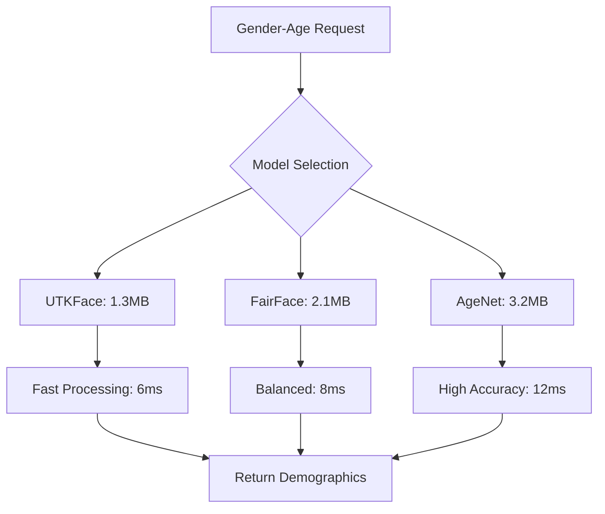

# Gender-Age Detection Service

## Overview

The Gender-Age Detection Service provides demographic analysis capabilities to determine gender and estimate age from face images. This lightweight service is optimized for real-time processing and minimal VRAM usage, making it ideal for analytics and user profiling applications.

## Model Architecture

### Supported Models

| Model | VRAM Usage | Gender Accuracy | Age MAE* | Speed | Use Case |
|-------|------------|-----------------|----------|-------|----------|
| **UTKFace MultiTask** | 1.3MB | 96.8% | 4.2 years | 6ms | General purpose |
| **FairFace CNN** | 2.1MB | 97.5% | 3.8 years | 8ms | Fair/balanced detection |
| **AgeNet-VGG** | 3.2MB | 95.2% | 3.5 years | 12ms | High age accuracy |

*MAE = Mean Absolute Error

### Detection Capabilities

```python
class GenderAgeCategories:
    # Gender categories
    MALE = "male"
    FEMALE = "female"
    
    # Age groups
    AGE_GROUPS = {
        "child": (0, 12),
        "teenager": (13, 19),
        "young_adult": (20, 30),
        "adult": (31, 50),
        "middle_aged": (51, 65),
        "senior": (66, 100)
    }
    
    @classmethod
    def get_age_group(cls, age: int) -> str:
        """Get age group category for given age"""
        for group, (min_age, max_age) in cls.AGE_GROUPS.items():
            if min_age <= age <= max_age:
                return group
        return "unknown"
    
    @classmethod
    def get_all_genders(cls):
        return [cls.MALE, cls.FEMALE]
```

## Implementation

### Core Service Class

```python
import numpy as np
import cv2
import onnxruntime as ort
from typing import Dict, Optional, Tuple, List
import logging
from dataclasses import dataclass
import time
import asyncio

@dataclass
class GenderAgeResult:
    """Gender and age detection result"""
    gender: str
    gender_confidence: float
    age: int
    age_confidence: float
    age_group: str
    processing_time: float
    model_used: str
    face_quality: float
    gender_probabilities: Optional[Dict[str, float]] = None

@dataclass
class DemographicStats:
    """Demographic statistics for analytics"""
    total_faces: int
    gender_distribution: Dict[str, int]
    age_distribution: Dict[str, int]
    average_age: float
    age_group_distribution: Dict[str, int]

class GenderAgeDetectionService:
    def __init__(self, config: dict):
        self.config = config
        self.models = {}
        self.current_model = 'utkface_multitask'
        self.logger = logging.getLogger(__name__)
        
        # Model configurations
        self.model_configs = {
            'utkface_multitask': {
                'input_size': (64, 64),
                'age_range': (0, 100),
                'has_multitask': True
            },
            'fairface_cnn': {
                'input_size': (224, 224),
                'age_range': (0, 100),
                'has_multitask': True
            },
            'agenet_vgg': {
                'input_size': (224, 224),
                'age_range': (0, 100),
                'has_multitask': False
            }
        }
        
        # Performance statistics
        self.stats = {
            'total_detections': 0,
            'gender_counts': {'male': 0, 'female': 0},
            'age_sum': 0,
            'age_group_counts': {},
            'average_processing_time': 0,
            'model_usage': {}
        }
        
        # Demographic analytics
        self.demographic_history = []
        self.max_history_size = 10000
    
    async def initialize(self, model_name: str = None):
        """Initialize the gender-age detection service"""
        try:
            if model_name:
                await self._load_model(model_name)
            else:
                await self._load_model('utkface_multitask')  # Default lightweight model
            
            self.logger.info(f"Gender-Age Detection Service initialized with {self.current_model}")
            return True
            
        except Exception as e:
            self.logger.error(f"Failed to initialize Gender-Age Detection Service: {e}")
            return False
    
    async def _load_model(self, model_name: str):
        """Load specific gender-age detection model"""
        model_paths = {
            'utkface_multitask': 'models/gender-age/utkface_multitask.onnx',
            'fairface_cnn': 'models/gender-age/fairface_cnn.onnx',
            'agenet_vgg': 'models/gender-age/agenet_vgg.onnx'
        }
        
        if model_name not in model_paths:
            raise ValueError(f"Unknown model: {model_name}")
        
        # Check VRAM availability (minimal for gender-age models)
        vram_requirements = {
            'utkface_multitask': 2,  # MB
            'fairface_cnn': 3,
            'agenet_vgg': 4
        }
        
        required_vram = vram_requirements[model_name]
        if not await self._check_vram_availability(required_vram):
            self.logger.warning(f"Low VRAM, using CPU for {model_name}")
        
        # Load model with GPU preference but CPU fallback
        providers = ['CUDAExecutionProvider', 'CPUExecutionProvider']
        session_options = ort.SessionOptions()
        session_options.graph_optimization_level = ort.GraphOptimizationLevel.ORT_ENABLE_ALL
        
        self.models[model_name] = ort.InferenceSession(
            model_paths[model_name],
            providers=providers,
            sess_options=session_options
        )
        
        self.current_model = model_name
        
        # Initialize usage statistics
        if model_name not in self.stats['model_usage']:
            self.stats['model_usage'][model_name] = 0
    
    def detect_gender_age(self, face_image: np.ndarray) -> GenderAgeResult:
        """
        Detect gender and age from face image
        
        Args:
            face_image: Face region image
        
        Returns:
            GenderAgeResult with gender and age predictions
        """
        start_time = time.time()
        
        try:
            # Preprocess face image
            processed_image = self._preprocess_face(face_image)
            
            # Run inference
            model = self.models[self.current_model]
            inputs = {model.get_inputs()[0].name: processed_image}
            outputs = model.run(None, inputs)
            
            # Process model outputs
            gender, gender_confidence, gender_probs = self._process_gender_output(outputs)
            age, age_confidence = self._process_age_output(outputs)
            
            # Determine age group
            age_group = GenderAgeCategories.get_age_group(age)
            
            # Calculate face quality
            face_quality = self._calculate_face_quality(face_image)
            
            processing_time = time.time() - start_time
            
            # Update statistics
            self._update_statistics(gender, age, age_group, processing_time)
            
            # Add to demographic history for analytics
            self._add_to_demographic_history(gender, age, age_group)
            
            return GenderAgeResult(
                gender=gender,
                gender_confidence=gender_confidence,
                age=age,
                age_confidence=age_confidence,
                age_group=age_group,
                processing_time=processing_time,
                model_used=self.current_model,
                face_quality=face_quality,
                gender_probabilities=gender_probs
            )
            
        except Exception as e:
            self.logger.error(f"Gender-age detection failed: {e}")
            raise
    
    def _preprocess_face(self, face_image: np.ndarray) -> np.ndarray:
        """Preprocess face image for gender-age model"""
        config = self.model_configs[self.current_model]
        input_size = config['input_size']
        
        # Resize to model input size
        face_image = cv2.resize(face_image, input_size)
        face_image = face_image.astype(np.float32) / 255.0
        
        if self.current_model == 'utkface_multitask':
            # UTKFace preprocessing
            face_image = (face_image - 0.5) / 0.5  # Normalize to [-1, 1]
            
        elif self.current_model == 'fairface_cnn':
            # FairFace preprocessing (ImageNet normalization)
            mean = np.array([0.485, 0.456, 0.406])
            std = np.array([0.229, 0.224, 0.225])
            face_image = (face_image - mean) / std
            
        elif self.current_model == 'agenet_vgg':
            # AgeNet preprocessing
            mean = np.array([0.5, 0.5, 0.5])
            face_image = face_image - mean
        
        # Add batch dimension and transpose to NCHW format
        face_image = np.transpose(face_image, (2, 0, 1))
        face_image = np.expand_dims(face_image, axis=0)
        
        return face_image
    
    def _process_gender_output(self, outputs: List[np.ndarray]) -> Tuple[str, float, Dict[str, float]]:
        """Process gender prediction from model outputs"""
        if self.current_model == 'utkface_multitask':
            # UTKFace has multitask output: [age, gender]
            gender_logits = outputs[1][0]  # Gender output
            gender_probs = self._softmax(gender_logits)
            
        elif self.current_model == 'fairface_cnn':
            # FairFace has separate outputs
            gender_probs = outputs[0][0]  # First output is gender
            
        elif self.current_model == 'agenet_vgg':
            # AgeNet is age-only, assume separate gender model or combined output
            if len(outputs) > 1:
                gender_probs = outputs[1][0]
            else:
                # Fallback: random assignment (should not happen in production)
                gender_probs = np.array([0.5, 0.5])
        
        # Map probabilities to gender labels
        gender_prob_dict = {
            'male': float(gender_probs[0]),
            'female': float(gender_probs[1])
        }
        
        # Determine predicted gender
        predicted_gender = 'male' if gender_probs[0] > gender_probs[1] else 'female'
        confidence = float(np.max(gender_probs))
        
        return predicted_gender, confidence, gender_prob_dict
    
    def _process_age_output(self, outputs: List[np.ndarray]) -> Tuple[int, float]:
        """Process age prediction from model outputs"""
        if self.current_model == 'utkface_multitask':
            # UTKFace age output (regression)
            age_output = outputs[0][0]  # Age output
            if len(age_output.shape) == 0:  # Scalar output
                predicted_age = float(age_output)
                confidence = 0.8  # Default confidence for regression
            else:  # Classification output
                age_probs = self._softmax(age_output)
                predicted_age = np.argmax(age_probs)
                confidence = float(np.max(age_probs))
                
        elif self.current_model == 'fairface_cnn':
            # FairFace age groups (classification)
            age_group_probs = outputs[1][0] if len(outputs) > 1 else outputs[0][0]
            
            # Map age group indices to actual ages (simplified)
            age_group_mapping = [5, 15, 25, 35, 45, 55, 65, 75, 85]  # Mid-points of age groups
            predicted_age_idx = np.argmax(age_group_probs)
            predicted_age = age_group_mapping[min(predicted_age_idx, len(age_group_mapping) - 1)]
            confidence = float(age_group_probs[predicted_age_idx])
            
        elif self.current_model == 'agenet_vgg':
            # AgeNet regression
            age_output = outputs[0][0]
            predicted_age = float(age_output)
            confidence = 0.8  # Default confidence for regression
        
        # Clamp age to reasonable range
        config = self.model_configs[self.current_model]
        min_age, max_age = config['age_range']
        predicted_age = max(min_age, min(max_age, int(predicted_age)))
        
        return predicted_age, confidence
    
    def _softmax(self, logits: np.ndarray) -> np.ndarray:
        """Apply softmax to logits"""
        exp_logits = np.exp(logits - np.max(logits))
        return exp_logits / np.sum(exp_logits)
    
    def _calculate_face_quality(self, face_image: np.ndarray) -> float:
        """Calculate face image quality metrics"""
        gray = cv2.cvtColor(face_image, cv2.COLOR_RGB2GRAY)
        
        # Sharpness using Laplacian variance
        sharpness = cv2.Laplacian(gray, cv2.CV_64F).var()
        sharpness_score = min(sharpness / 500, 1.0)
        
        # Brightness score
        brightness = np.mean(gray)
        brightness_score = 1.0 - abs(brightness - 128) / 128
        
        # Overall quality
        quality = (sharpness_score * 0.7 + brightness_score * 0.3)
        return max(0.0, min(1.0, quality))
    
    def _update_statistics(self, gender: str, age: int, age_group: str, processing_time: float):
        """Update service statistics"""
        self.stats['total_detections'] += 1
        self.stats['model_usage'][self.current_model] += 1
        
        # Update gender counts
        if gender in self.stats['gender_counts']:
            self.stats['gender_counts'][gender] += 1
        
        # Update age statistics
        self.stats['age_sum'] += age
        
        # Update age group counts
        if age_group not in self.stats['age_group_counts']:
            self.stats['age_group_counts'][age_group] = 0
        self.stats['age_group_counts'][age_group] += 1
        
        # Update average processing time
        total = self.stats['total_detections']
        current_avg = self.stats['average_processing_time']
        self.stats['average_processing_time'] = (
            (current_avg * (total - 1) + processing_time) / total
        )
    
    def _add_to_demographic_history(self, gender: str, age: int, age_group: str):
        """Add detection result to demographic history for analytics"""
        entry = {
            'timestamp': time.time(),
            'gender': gender,
            'age': age,
            'age_group': age_group
        }
        
        self.demographic_history.append(entry)
        
        # Maintain history size limit
        if len(self.demographic_history) > self.max_history_size:
            self.demographic_history.pop(0)
    
    def get_demographic_analytics(self, time_window_hours: Optional[float] = None) -> DemographicStats:
        """Get demographic analytics for specified time window"""
        current_time = time.time()
        
        # Filter by time window if specified
        if time_window_hours:
            cutoff_time = current_time - (time_window_hours * 3600)
            filtered_history = [
                entry for entry in self.demographic_history 
                if entry['timestamp'] >= cutoff_time
            ]
        else:
            filtered_history = self.demographic_history
        
        if not filtered_history:
            return DemographicStats(0, {}, {}, 0.0, {})
        
        # Calculate distributions
        gender_dist = {}
        age_dist = {}
        age_group_dist = {}
        ages = []
        
        for entry in filtered_history:
            # Gender distribution
            gender = entry['gender']
            gender_dist[gender] = gender_dist.get(gender, 0) + 1
            
            # Age statistics
            age = entry['age']
            ages.append(age)
            
            # Age group distribution
            age_group = entry['age_group']
            age_group_dist[age_group] = age_group_dist.get(age_group, 0) + 1
            
            # Age range distribution (by decade)
            age_decade = f"{(age // 10) * 10}s"
            age_dist[age_decade] = age_dist.get(age_decade, 0) + 1
        
        average_age = np.mean(ages) if ages else 0.0
        
        return DemographicStats(
            total_faces=len(filtered_history),
            gender_distribution=gender_dist,
            age_distribution=age_dist,
            average_age=average_age,
            age_group_distribution=age_group_dist
        )
    
    async def _check_vram_availability(self, required_mb: int) -> bool:
        """Check if required VRAM is available"""
        # Gender-age models are very lightweight
        return True
    
    def get_statistics(self) -> dict:
        """Get service performance statistics"""
        total = self.stats['total_detections']
        avg_age = self.stats['age_sum'] / total if total > 0 else 0
        
        return {
            'current_model': self.current_model,
            'total_detections': total,
            'gender_distribution': self.stats['gender_counts'],
            'average_age': avg_age,
            'age_group_distribution': self.stats['age_group_counts'],
            'average_processing_time': self.stats['average_processing_time'],
            'model_usage': self.stats['model_usage']
        }
    
    async def switch_model(self, model_name: str) -> bool:
        """Switch to a different gender-age detection model"""
        try:
            if model_name not in self.models:
                await self._load_model(model_name)
            else:
                self.current_model = model_name
            
            self.logger.info(f"Switched to gender-age model: {model_name}")
            return True
            
        except Exception as e:
            self.logger.error(f"Failed to switch to model {model_name}: {e}")
            return False
    
    def cleanup(self):
        """Clean up resources"""
        for model in self.models.values():
            del model
        self.models.clear()
        self.demographic_history.clear()
```

## API Integration

### REST Endpoints

```python
from fastapi import APIRouter, HTTPException, File, UploadFile
from typing import List, Optional
import base64
import io
from PIL import Image

router = APIRouter(prefix="/api/v1/gender-age", tags=["gender-age"])

@router.post("/detect")
async def detect_gender_age(
    image: UploadFile = File(...),
    model: Optional[str] = None
):
    """Detect gender and age from face image"""
    try:
        # Load and process image
        image_data = await image.read()
        pil_image = Image.open(io.BytesIO(image_data))
        face_array = np.array(pil_image)
        
        # Switch model if specified
        if model:
            await gender_age_service.switch_model(model)
        
        # Detect gender and age
        result = gender_age_service.detect_gender_age(face_array)
        
        return {
            "success": True,
            "gender": result.gender,
            "gender_confidence": result.gender_confidence,
            "age": result.age,
            "age_confidence": result.age_confidence,
            "age_group": result.age_group,
            "processing_time": result.processing_time,
            "model_used": result.model_used,
            "face_quality": result.face_quality,
            "gender_probabilities": result.gender_probabilities
        }
        
    except Exception as e:
        raise HTTPException(status_code=500, detail=str(e))

@router.post("/batch-detect")
async def batch_detect_gender_age(
    images: List[UploadFile] = File(...),
    model: Optional[str] = None
):
    """Batch detect gender and age from multiple face images"""
    try:
        if len(images) > 50:  # Limit batch size
            raise HTTPException(status_code=400, detail="Batch size too large (max 50)")
        
        # Switch model if specified
        if model:
            await gender_age_service.switch_model(model)
        
        results = []
        for i, image in enumerate(images):
            try:
                image_data = await image.read()
                pil_image = Image.open(io.BytesIO(image_data))
                face_array = np.array(pil_image)
                
                result = gender_age_service.detect_gender_age(face_array)
                
                results.append({
                    "index": i,
                    "success": True,
                    "gender": result.gender,
                    "gender_confidence": result.gender_confidence,
                    "age": result.age,
                    "age_confidence": result.age_confidence,
                    "age_group": result.age_group,
                    "face_quality": result.face_quality
                })
                
            except Exception as e:
                results.append({
                    "index": i,
                    "success": False,
                    "error": str(e)
                })
        
        # Calculate batch statistics
        successful_results = [r for r in results if r["success"]]
        batch_stats = {
            "total_images": len(images),
            "successful_detections": len(successful_results),
            "average_age": np.mean([r["age"] for r in successful_results]) if successful_results else 0,
            "gender_distribution": {
                "male": sum(1 for r in successful_results if r["gender"] == "male"),
                "female": sum(1 for r in successful_results if r["gender"] == "female")
            }
        }
        
        return {
            "success": True,
            "results": results,
            "batch_statistics": batch_stats
        }
        
    except Exception as e:
        raise HTTPException(status_code=500, detail=str(e))

@router.get("/analytics")
async def get_demographic_analytics(time_window_hours: Optional[float] = None):
    """Get demographic analytics for specified time window"""
    try:
        analytics = gender_age_service.get_demographic_analytics(time_window_hours)
        
        return {
            "success": True,
            "time_window_hours": time_window_hours,
            "total_faces": analytics.total_faces,
            "gender_distribution": analytics.gender_distribution,
            "age_distribution": analytics.age_distribution,
            "average_age": analytics.average_age,
            "age_group_distribution": analytics.age_group_distribution
        }
        
    except Exception as e:
        raise HTTPException(status_code=500, detail=str(e))

@router.get("/statistics")
async def get_gender_age_statistics():
    """Get gender-age detection service statistics"""
    return gender_age_service.get_statistics()

@router.post("/switch-model")
async def switch_gender_age_model(model_name: str):
    """Switch to a different gender-age detection model"""
    success = await gender_age_service.switch_model(model_name)
    
    if success:
        return {"success": True, "current_model": model_name}
    else:
        raise HTTPException(status_code=500, detail="Failed to switch model")

@router.get("/supported-models")
async def get_supported_models():
    """Get list of supported gender-age detection models"""
    return {
        "models": [
            {
                "name": "utkface_multitask",
                "description": "UTKFace MultiTask - Lightweight multitask model",
                "vram_usage": "1.3MB",
                "gender_accuracy": "96.8%",
                "age_mae": "4.2 years",
                "speed": "6ms"
            },
            {
                "name": "fairface_cnn",
                "description": "FairFace CNN - Balanced demographic detection",
                "vram_usage": "2.1MB",
                "gender_accuracy": "97.5%",
                "age_mae": "3.8 years",
                "speed": "8ms"
            },
            {
                "name": "agenet_vgg",
                "description": "AgeNet VGG - High age accuracy",
                "vram_usage": "3.2MB",
                "gender_accuracy": "95.2%",
                "age_mae": "3.5 years",
                "speed": "12ms"
            }
        ]
    }
```

## Integration Examples

### Real-time Demographics Analysis

```python
class RealtimeDemographicsAnalyzer:
    def __init__(self, face_detection_service, gender_age_service):
        self.detection_service = face_detection_service
        self.gender_age_service = gender_age_service
        self.session_analytics = {}
    
    async def analyze_crowd_demographics(self, image: np.ndarray, session_id: str = None) -> dict:
        """Analyze demographics of all faces in an image"""
        
        # Detect all faces
        faces = await self.detection_service.detect_faces(image)
        if not faces:
            return {"success": False, "error": "No faces detected"}
        
        demographics = []
        
        for face in faces:
            face_region = self._extract_face_region(image, face)
            
            # Detect gender and age
            result = self.gender_age_service.detect_gender_age(face_region)
            
            demographics.append({
                "face_bbox": face.bbox,
                "gender": result.gender,
                "gender_confidence": result.gender_confidence,
                "age": result.age,
                "age_group": result.age_group,
                "quality": result.face_quality
            })
        
        # Calculate crowd statistics
        crowd_stats = self._calculate_crowd_statistics(demographics)
        
        # Update session analytics if session_id provided
        if session_id:
            self._update_session_analytics(session_id, demographics)
        
        return {
            "success": True,
            "total_faces": len(demographics),
            "demographics": demographics,
            "crowd_statistics": crowd_stats
        }
    
    def _calculate_crowd_statistics(self, demographics: List[dict]) -> dict:
        """Calculate statistics for detected crowd"""
        if not demographics:
            return {}
        
        # Gender distribution
        gender_counts = {}
        for demo in demographics:
            gender = demo["gender"]
            gender_counts[gender] = gender_counts.get(gender, 0) + 1
        
        # Age statistics
        ages = [demo["age"] for demo in demographics]
        age_groups = [demo["age_group"] for demo in demographics]
        
        age_group_counts = {}
        for group in age_groups:
            age_group_counts[group] = age_group_counts.get(group, 0) + 1
        
        return {
            "gender_distribution": gender_counts,
            "gender_percentages": {
                gender: (count / len(demographics)) * 100 
                for gender, count in gender_counts.items()
            },
            "age_statistics": {
                "average": np.mean(ages),
                "median": np.median(ages),
                "min": np.min(ages),
                "max": np.max(ages)
            },
            "age_group_distribution": age_group_counts,
            "dominant_age_group": max(age_group_counts, key=age_group_counts.get),
            "dominant_gender": max(gender_counts, key=gender_counts.get)
        }
```

## Performance Characteristics

### VRAM Usage Pattern



## Configuration

### Service Configuration

```yaml
gender_age_detection:
  default_model: "utkface_multitask"
  
  models:
    utkface_multitask:
      path: "models/gender-age/utkface_multitask.onnx"
      input_size: [64, 64]
      age_range: [0, 100]
      multitask: true
      
    fairface_cnn:
      path: "models/gender-age/fairface_cnn.onnx"
      input_size: [224, 224]
      age_range: [0, 100]
      multitask: true
      
    agenet_vgg:
      path: "models/gender-age/agenet_vgg.onnx"
      input_size: [224, 224]
      age_range: [0, 100]
      multitask: false
  
  analytics:
    enable_demographic_history: true
    max_history_size: 10000
    default_time_window_hours: 24
  
  performance:
    max_concurrent_requests: 10
    batch_size_limit: 50
    enable_gpu: true
    fallback_to_cpu: true
```

## Testing

### Unit Tests

```python
import pytest
import numpy as np
from unittest.mock import patch, MagicMock

class TestGenderAgeDetectionService:
    @pytest.fixture
    async def service(self):
        config = {"model_path": "test_models/"}
        service = GenderAgeDetectionService(config)
        await service.initialize("utkface_multitask")
        return service
    
    async def test_gender_detection(self, service):
        """Test gender detection functionality"""
        test_face = np.random.randint(0, 255, (64, 64, 3), dtype=np.uint8)
        
        # Mock model output
        with patch.object(service.models['utkface_multitask'], 'run') as mock_run:
            mock_run.return_value = [
                np.array([[25.5]]),      # Age output
                np.array([[0.8, 0.2]])   # Gender output [male, female]
            ]
            
            result = service.detect_gender_age(test_face)
            
            assert result.gender == "male"
            assert result.gender_confidence == 0.8
            assert result.age == 25
    
    async def test_age_group_classification(self, service):
        """Test age group classification"""
        test_ages = [5, 16, 25, 40, 60, 80]
        expected_groups = ["child", "teenager", "young_adult", "adult", "middle_aged", "senior"]
        
        for age, expected_group in zip(test_ages, expected_groups):
            group = GenderAgeCategories.get_age_group(age)
            assert group == expected_group
    
    async def test_demographic_analytics(self, service):
        """Test demographic analytics functionality"""
        # Add some test data to history
        test_demographics = [
            ("male", 25, "young_adult"),
            ("female", 30, "young_adult"),
            ("male", 45, "adult"),
            ("female", 60, "middle_aged")
        ]
        
        for gender, age, age_group in test_demographics:
            service._add_to_demographic_history(gender, age, age_group)
        
        analytics = service.get_demographic_analytics()
        
        assert analytics.total_faces == 4
        assert analytics.gender_distribution["male"] == 2
        assert analytics.gender_distribution["female"] == 2
        assert analytics.average_age == 40.0
```

## Best Practices

### 1. Model Selection
- Use UTKFace for real-time applications requiring minimal resources
- Choose FairFace for balanced accuracy across diverse demographics
- Select AgeNet when age precision is critical

### 2. Performance Optimization
- Batch process multiple faces for analytics applications
- Cache model outputs for repeated analysis
- Use appropriate input resolutions based on accuracy requirements

### 3. Privacy Considerations
- Implement data anonymization for demographic analytics
- Provide opt-out mechanisms for demographic tracking
- Ensure compliance with privacy regulations

### 4. Bias Mitigation
- Use diverse training datasets (FairFace recommended)
- Monitor performance across different demographic groups
- Implement bias detection and correction mechanisms

## Troubleshooting

### Common Issues

1. **Age Estimation Errors**: Validate face quality, improve lighting conditions
2. **Gender Misclassification**: Check for image preprocessing issues
3. **Poor Performance**: Enable GPU acceleration, optimize batch sizes
4. **Memory Issues**: Use lighter models, implement proper cleanup

### Monitoring

- Track accuracy across different age groups and genders
- Monitor processing times and resource usage
- Alert on unusual demographic distribution patterns
- Log quality metrics for continuous improvement
