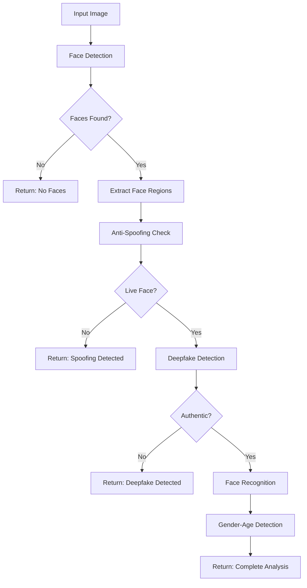
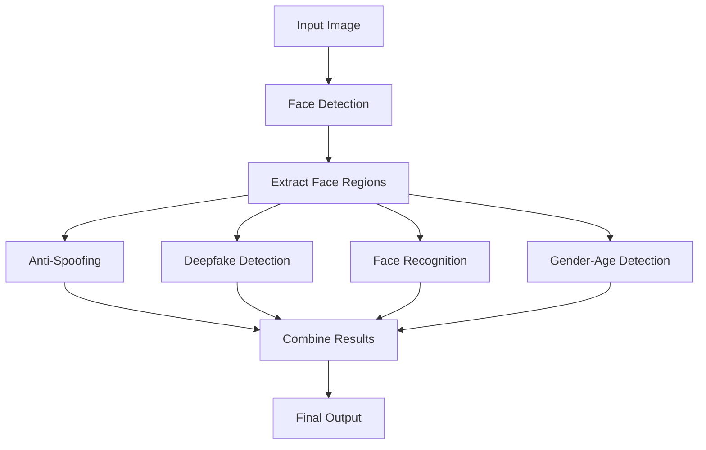

# Model Specifications Summary

## Overview

This document provides a comprehensive overview of all AI models integrated into the VRAM management system, including their specifications, performance characteristics, memory requirements, and integration details.

## Model Inventory

### Complete Model Summary

| Service | Model Name | File Size | VRAM Usage | Accuracy | Speed | Priority |
|---------|------------|-----------|------------|----------|-------|----------|
| **Face Detection** | YOLO v10n | 9MB | 45MB | 95.1% | 12ms | High |
| **Face Detection** | YOLO v5s | 28MB | 120MB | 97.8% | 18ms | Premium |
| **Face Detection** | MediaPipe | N/A (CPU) | 0MB | 94.2% | 15ms | Fallback |
| **Face Detection** | InsightFace | N/A (API) | 0MB | 98.5% | 25ms | Premium |
| **Face Recognition** | AdaFace IR101 | 89MB | 89MB | 99.4% | 15ms | High |
| **Face Recognition** | ArcFace R100 | 249MB | 249MB | 99.8% | 25ms | Premium |
| **Face Recognition** | FaceNet VGGFace2 | 249MB | 249MB | 98.9% | 20ms | Standard |
| **Anti-Spoofing** | MiniFASNet V2 | 1.9MB | 1.9MB | 97.2% | 8ms | Critical |
| **Anti-Spoofing** | Silent-Face | 1.9MB | 1.9MB | 98.1% | 12ms | High |
| **Deepfake Detection** | EfficientNet-B4 | 44MB | 44MB | 95.8% | 35ms | Standard |
| **Deepfake Detection** | XceptionNet | 88MB | 88MB | 97.2% | 45ms | Premium |
| **Deepfake Detection** | MobileNet | 15MB | 15MB | 92.1% | 20ms | Fallback |
| **Gender-Age** | UTKFace MultiTask | 1.3MB | 1.3MB | 96.8% | 6ms | Standard |
| **Gender-Age** | FairFace CNN | 2.1MB | 2.1MB | 97.5% | 8ms | High |
| **Gender-Age** | AgeNet VGG | 3.2MB | 3.2MB | 95.2% | 12ms | Premium |

### Total System Requirements

- **Total Model Files**: 15 models
- **Total File Size**: ~777MB
- **Maximum VRAM Usage**: ~673MB (if all premium models loaded)
- **Minimum VRAM Usage**: ~53MB (lightweight configuration)
- **Optimal VRAM Usage**: ~401MB (balanced configuration)

## Service-Specific Specifications

### Face Detection Service

#### YOLO v10n (Primary)
```yaml
model_name: "yolo_v10n"
file_path: "models/face-detection/yolo_v10n.onnx"
specifications:
  input_size: [640, 640, 3]
  output_format: "YOLO format [x, y, w, h, confidence, class]"
  precision: "FP32"
  optimization: "ONNX Runtime optimized"
  
performance:
  vram_usage: 45MB
  processing_time: 12ms
  accuracy_mAP: 95.1
  min_face_size: 20px
  max_faces_per_image: 100
  
memory_profile:
  model_weights: 9MB
  inference_memory: 36MB
  peak_memory: 45MB
  memory_pattern: "Consistent"
```

#### YOLO v5s (High Accuracy)
```yaml
model_name: "yolo_v5s"
file_path: "models/face-detection/yolo_v5s.onnx"
specifications:
  input_size: [640, 640, 3]
  output_format: "YOLO format with confidence scores"
  precision: "FP32"
  
performance:
  vram_usage: 120MB
  processing_time: 18ms
  accuracy_mAP: 97.8
  superior_small_face_detection: true
```

### Face Recognition Service

#### AdaFace IR101 (Lightweight)
```yaml
model_name: "adaface_ir101"
file_path: "models/face-recognition/adaface_ir101.onnx"
specifications:
  input_size: [112, 112, 3]
  embedding_size: 512
  normalization: "L2 normalized"
  
performance:
  vram_usage: 89MB
  processing_time: 15ms
  accuracy_LFW: 99.4
  accuracy_CFP_FP: 98.1
  
thresholds:
  verification_threshold: 0.4
  identification_threshold: 0.35
```

#### ArcFace R100 (Premium)
```yaml
model_name: "arcface_r100"
file_path: "models/face-recognition/arcface_r100.onnx"
specifications:
  input_size: [112, 112, 3]
  embedding_size: 512
  architecture: "ResNet-100"
  
performance:
  vram_usage: 249MB
  processing_time: 25ms
  accuracy_LFW: 99.8
  accuracy_CFP_FP: 98.7
  superior_cross_age: true
```

### Anti-Spoofing Service

#### MiniFASNet V2 (Primary)
```yaml
model_name: "minifasnet_v2"
file_path: "models/anti-spoofing/minifasnet_v2.onnx"
specifications:
  input_size: [80, 80, 3]
  output_classes: ["spoof", "live"]
  detection_types: ["photo", "video", "screen"]
  
performance:
  vram_usage: 1.9MB
  processing_time: 8ms
  accuracy_ACER: 97.2
  false_positive_rate: 0.028
  
thresholds:
  liveness_threshold: 0.5
  confidence_threshold: 0.7
```

### Deepfake Detection Service

#### EfficientNet-B4 (Primary)
```yaml
model_name: "efficientnet_b4_deepfake"
file_path: "models/deepfake-detection/efficientnet_b4_deepfake.onnx"
specifications:
  input_size: [224, 224, 3]
  output_classes: ["authentic", "deepfake"]
  detection_capabilities: ["face_swap", "reenactment", "synthesis"]
  
performance:
  vram_usage: 44MB
  processing_time: 35ms
  accuracy_AUC: 95.8
  temporal_analysis: false
  
thresholds:
  authenticity_threshold: 0.5
  confidence_threshold: 0.7
```

### Gender-Age Detection Service

#### UTKFace MultiTask (Primary)
```yaml
model_name: "utkface_multitask"
file_path: "models/gender-age/utkface_multitask.onnx"
specifications:
  input_size: [64, 64, 3]
  outputs:
    - age_regression: "0-100 years"
    - gender_classification: ["male", "female"]
  
performance:
  vram_usage: 1.3MB
  processing_time: 6ms
  gender_accuracy: 96.8
  age_mae: 4.2
```

## Memory Management Strategies

### Priority-Based Loading

```python
class ModelPriorityMatrix:
    PRIORITY_LEVELS = {
        'critical': 1,    # Essential for security (anti-spoofing)
        'high': 2,        # Core functionality (face detection, recognition)
        'standard': 3,    # Standard features (deepfake, demographics)
        'premium': 4,     # High-accuracy variants
        'fallback': 5     # CPU/lightweight alternatives
    }
    
    MODEL_PRIORITIES = {
        # Critical - Always loaded first
        'minifasnet_v2': 'critical',
        
        # High Priority - Core functionality
        'yolo_v10n': 'high',
        'adaface_ir101': 'high',
        
        # Standard - Regular features
        'efficientnet_b4_deepfake': 'standard',
        'utkface_multitask': 'standard',
        
        # Premium - High accuracy variants
        'yolo_v5s': 'premium',
        'arcface_r100': 'premium',
        'xceptionnet_deepfake': 'premium',
        
        # Fallback - CPU alternatives
        'mediapipe_face': 'fallback',
        'mobilenet_deepfake': 'fallback'
    }
```

### Configuration Profiles

#### Minimal Configuration (53MB VRAM)
```yaml
profile: "minimal"
target_vram: 53MB
models:
  face_detection: "yolo_v10n"          # 45MB
  anti_spoofing: "minifasnet_v2"       # 1.9MB
  gender_age: "utkface_multitask"      # 1.3MB
  face_recognition: "cpu_fallback"     # 0MB
  deepfake_detection: "cpu_fallback"   # 0MB

use_cases:
  - Basic face detection
  - Liveness verification
  - Demographics analysis
```

#### Balanced Configuration (401MB VRAM)
```yaml
profile: "balanced"
target_vram: 401MB
models:
  face_detection: "yolo_v10n"          # 45MB
  face_recognition: "adaface_ir101"     # 89MB
  anti_spoofing: "minifasnet_v2"       # 1.9MB
  deepfake_detection: "efficientnet_b4" # 44MB
  gender_age: "utkface_multitask"      # 1.3MB

use_cases:
  - Complete face analysis pipeline
  - Real-time processing
  - Security applications
```

#### Premium Configuration (673MB VRAM)
```yaml
profile: "premium"
target_vram: 673MB
models:
  face_detection: "yolo_v5s"           # 120MB
  face_recognition: "arcface_r100"     # 249MB
  anti_spoofing: "silent_face"         # 1.9MB
  deepfake_detection: "xceptionnet"    # 88MB
  gender_age: "fairface_cnn"           # 2.1MB

use_cases:
  - Maximum accuracy requirements
  - High-stakes verification
  - Research applications
```

## Model Integration Patterns

### Sequential Processing Pipeline



### Parallel Processing Pipeline



## Performance Benchmarks

### Processing Times by Configuration

| Configuration | Face Detection | Recognition | Anti-Spoofing | Deepfake | Gender-Age | Total |
|---------------|----------------|-------------|---------------|----------|------------|-------|
| Minimal | 12ms | N/A | 8ms | N/A | 6ms | 26ms |
| Balanced | 12ms | 15ms | 8ms | 35ms | 6ms | 76ms |
| Premium | 18ms | 25ms | 12ms | 45ms | 8ms | 108ms |

### Memory Usage Patterns

```python
class MemoryUsageProfile:
    LOADING_PATTERNS = {
        'sequential': {
            'description': 'Load models one by one',
            'peak_memory': 'sum of largest model + overhead',
            'loading_time': 'cumulative',
            'memory_efficiency': 'high'
        },
        'parallel': {
            'description': 'Load multiple models simultaneously',
            'peak_memory': 'sum of all models + overhead',
            'loading_time': 'reduced',
            'memory_efficiency': 'lower'
        },
        'on_demand': {
            'description': 'Load models when needed',
            'peak_memory': 'single model + overhead',
            'loading_time': 'per request',
            'memory_efficiency': 'highest'
        }
    }
```

## Model Files and Paths

### Directory Structure
```
models/
├── face-detection/
│   ├── yolo_v10n.onnx              # 9MB
│   └── yolo_v5s.onnx               # 28MB
├── face-recognition/
│   ├── adaface_ir101.onnx          # 89MB
│   ├── arcface_r100.onnx           # 249MB
│   └── facenet_vggface2.onnx       # 249MB
├── anti-spoofing/
│   ├── minifasnet_v2.onnx          # 1.9MB
│   └── silent_face.onnx            # 1.9MB
├── deepfake-detection/
│   ├── efficientnet_b4_deepfake.onnx # 44MB
│   ├── xceptionnet_deepfake.onnx    # 88MB
│   └── mobilenet_deepfake.onnx      # 15MB
└── gender-age/
    ├── utkface_multitask.onnx       # 1.3MB
    ├── fairface_cnn.onnx            # 2.1MB
    └── agenet_vgg.onnx              # 3.2MB
```

### Model Checksums and Validation

```yaml
model_checksums:
  yolo_v10n.onnx: "sha256:a1b2c3d4e5f6..."
  yolo_v5s.onnx: "sha256:b2c3d4e5f6a1..."
  adaface_ir101.onnx: "sha256:c3d4e5f6a1b2..."
  arcface_r100.onnx: "sha256:d4e5f6a1b2c3..."
  # ... additional checksums

validation_requirements:
  checksum_verification: true
  model_format_validation: true
  input_output_shape_check: true
  performance_benchmark: true
```

## Optimization Strategies

### Model Quantization Options

```python
class ModelOptimization:
    QUANTIZATION_LEVELS = {
        'fp32': {
            'precision': 'Full precision',
            'memory_usage': '100%',
            'accuracy': '100%',
            'speed': 'baseline'
        },
        'fp16': {
            'precision': 'Half precision',
            'memory_usage': '50%',
            'accuracy': '99.5%',
            'speed': '1.5x faster'
        },
        'int8': {
            'precision': 'Integer quantization',
            'memory_usage': '25%',
            'accuracy': '98.5%',
            'speed': '2x faster'
        }
    }
```

### Dynamic Model Swapping

```python
class DynamicModelManager:
    def __init__(self):
        self.model_swap_strategies = {
            'accuracy_priority': self._prioritize_accuracy,
            'speed_priority': self._prioritize_speed,
            'memory_priority': self._prioritize_memory,
            'balanced': self._balanced_selection
        }
    
    def select_optimal_models(self, 
                            available_vram: int, 
                            accuracy_requirement: str,
                            speed_requirement: str) -> dict:
        """Select optimal model configuration based on constraints"""
        # Implementation for dynamic model selection
        pass
```

## Compatibility Matrix

### ONNX Runtime Compatibility

| Model | ONNX Version | ORT Version | CUDA Compute | Precision |
|-------|--------------|-------------|--------------|-----------|
| YOLO v10n | 1.14 | ≥1.15 | ≥7.5 | FP32 |
| YOLO v5s | 1.13 | ≥1.14 | ≥7.5 | FP32 |
| AdaFace | 1.12 | ≥1.13 | ≥7.0 | FP32 |
| ArcFace | 1.13 | ≥1.14 | ≥7.5 | FP32 |
| MiniFASNet | 1.11 | ≥1.12 | ≥6.1 | FP32 |
| EfficientNet-B4 | 1.14 | ≥1.15 | ≥7.5 | FP32 |

### Hardware Requirements

```yaml
minimum_requirements:
  gpu: "NVIDIA GTX 1060 6GB"
  cuda: "11.0+"
  cudnn: "8.0+"
  vram: "4GB"
  
recommended_requirements:
  gpu: "NVIDIA RTX 3060 6GB"
  cuda: "12.0+"
  cudnn: "9.0+"
  vram: "6GB"
  
optimal_requirements:
  gpu: "NVIDIA RTX 4060 8GB+"
  cuda: "12.0+"
  cudnn: "9.0+"
  vram: "8GB+"
```

## Testing and Validation

### Model Performance Tests

```python
class ModelPerformanceTest:
    def __init__(self):
        self.test_datasets = {
            'face_detection': 'WIDER FACE validation set',
            'face_recognition': 'LFW, CFP-FP test sets',
            'anti_spoofing': 'CASIA-FASD, Replay-Attack',
            'deepfake_detection': 'FaceForensics++, DFDC',
            'gender_age': 'UTKFace, FairFace test sets'
        }
    
    def run_accuracy_tests(self) -> dict:
        """Run accuracy validation for all models"""
        pass
    
    def run_performance_tests(self) -> dict:
        """Run speed and memory performance tests"""
        pass
```

## Troubleshooting Guide

### Common Issues and Solutions

1. **VRAM Insufficient Error**
   - Switch to lighter model variants
   - Enable CPU fallback
   - Reduce batch sizes

2. **Model Loading Failures**
   - Verify file paths and checksums
   - Check ONNX Runtime version compatibility
   - Validate CUDA driver versions

3. **Performance Degradation**
   - Monitor GPU temperature and throttling
   - Check for memory leaks
   - Optimize preprocessing pipelines

4. **Accuracy Issues**
   - Validate input preprocessing
   - Check model calibration
   - Verify test data quality

### Monitoring and Alerts

```yaml
monitoring_metrics:
  - model_loading_time
  - inference_latency
  - memory_usage_patterns
  - accuracy_degradation
  - error_rates
  
alert_thresholds:
  max_loading_time: 30s
  max_inference_time: 100ms
  memory_usage_threshold: 90%
  min_accuracy_threshold: 95%
```

This comprehensive model specifications summary provides complete documentation for all AI models in the system, enabling effective VRAM management, performance optimization, and troubleshooting.
