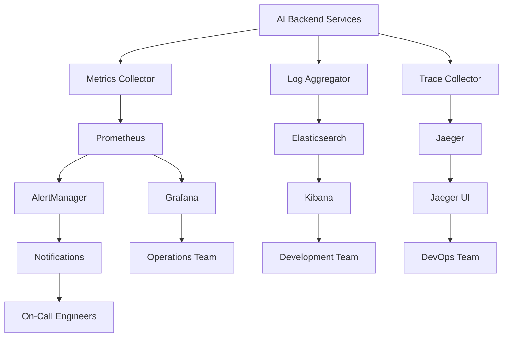

# Monitoring & Analytics Overview

Comprehensive monitoring and analytics system for VRAM-optimized AI backend with real-time performance tracking, alerting, and business intelligence.

## 📚 Section Contents

### Monitoring Documentation
- **[01-performance-monitoring.md](01-performance-monitoring.md)** - System and application performance monitoring
- **[02-logging-system.md](02-logging-system.md)** - Structured logging and log management
- **[03-analytics-dashboard.md](03-analytics-dashboard.md)** - Business intelligence and analytics dashboards
- **[04-alerting-notification.md](04-alerting-notification.md)** - Alert management and notification systems

## 📊 Monitoring Overview

### Monitoring Stack
- **Metrics**: Prometheus + Grafana
- **Logs**: ELK Stack (Elasticsearch, Logstash, Kibana)
- **Tracing**: Jaeger distributed tracing
- **Alerting**: AlertManager + PagerDuty
- **Analytics**: Custom dashboard + PostgreSQL
- **APM**: Sentry for error tracking

### Key Monitoring Areas
- **System Metrics**: CPU, Memory, GPU, Disk, Network
- **Application Metrics**: API performance, model inference
- **Business Metrics**: Usage analytics, user behavior
- **Security Metrics**: Authentication, authorization, threats
- **AI Model Metrics**: Accuracy, bias, drift detection

## 🚀 Quick Setup Guide

### 1. Deploy Monitoring Stack

```bash
# Deploy monitoring services
docker-compose -f docker-compose.monitoring.yml up -d

# Verify services
curl http://localhost:3000  # Grafana
curl http://localhost:9090  # Prometheus
curl http://localhost:5601  # Kibana
```

### 2. Configure Dashboards

```bash
# Import Grafana dashboards
./scripts/import-dashboards.sh

# Configure alerts
./scripts/setup-alerts.sh

# Test notifications
./scripts/test-alerts.sh
```

### 3. Verify Monitoring

```bash
# Check metrics collection
curl http://localhost:9090/api/v1/query?query=up

# Check log ingestion
curl http://localhost:9200/_cat/indices

# Test alerting
curl -X POST http://localhost:9093/api/v1/alerts
```

## 📈 Monitoring Architecture

### Data Flow Diagram


### Component Integration
```
┌─────────────────────────────────────────┐
│              AI Backend                 │
│  ┌─────────┐ ┌─────────┐ ┌─────────┐   │
│  │   API   │ │ Models  │ │  Queue  │   │
│  │ Server  │ │Service  │ │Manager  │   │
│  └────┬────┘ └────┬────┘ └────┬────┘   │
└───────┼──────────┼──────────┼─────────┘
        │          │          │
        ▼          ▼          ▼
┌─────────────────────────────────────────┐
│           Monitoring Layer              │
│  ┌─────────┐ ┌─────────┐ ┌─────────┐   │
│  │Metrics  │ │  Logs   │ │ Traces  │   │
│  │Collect  │ │Collect  │ │Collect  │   │
│  └────┬────┘ └────┬────┘ └────┬────┘   │
└───────┼──────────┼──────────┼─────────┘
        │          │          │
        ▼          ▼          ▼
┌─────────────────────────────────────────┐
│            Storage Layer                │
│  ┌─────────┐ ┌─────────┐ ┌─────────┐   │
│  │Prometheus│ │Elastic │ │ Jaeger  │   │
│  │(Metrics)│ │ Search  │ │(Traces) │   │
│  └────┬────┘ └────┬────┘ └────┬────┘   │
└───────┼──────────┼──────────┼─────────┘
        │          │          │
        ▼          ▼          ▼
┌─────────────────────────────────────────┐
│         Visualization Layer             │
│  ┌─────────┐ ┌─────────┐ ┌─────────┐   │
│  │ Grafana │ │ Kibana  │ │Analytics│   │
│  │(Metrics)│ │ (Logs)  │ │Dashboard│   │
│  └─────────┘ └─────────┘ └─────────┘   │
└─────────────────────────────────────────┘
```

## 🎯 Key Performance Indicators (KPIs)

### System KPIs
- **Availability**: 99.9% uptime target
- **Response Time**: <200ms API response
- **Throughput**: 1000+ requests/minute
- **Error Rate**: <0.1% error rate
- **VRAM Efficiency**: >80% utilization

### AI Model KPIs
- **Inference Time**: <100ms per face
- **Accuracy**: >95% detection accuracy
- **Model Load Time**: <30s cold start
- **Queue Wait Time**: <5s processing queue
- **Memory Efficiency**: <6GB total VRAM

### Business KPIs
- **Daily Active Users**: User engagement
- **API Usage Growth**: Month-over-month growth
- **Feature Adoption**: New feature usage
- **Customer Satisfaction**: Support ticket trends
- **Revenue Per User**: Monetization metrics

## 📊 Monitoring Dashboards

### 1. System Overview Dashboard
```yaml
dashboard_config:
  name: "System Overview"
  panels:
    - title: "System Health"
      metrics:
        - node_cpu_usage_percent
        - node_memory_usage_percent
        - nvidia_gpu_memory_usage_percent
        - node_disk_usage_percent
    
    - title: "API Performance"
      metrics:
        - http_request_duration_seconds
        - http_requests_total
        - http_request_size_bytes
        
    - title: "Database Performance"
      metrics:
        - postgresql_connections_active
        - postgresql_query_duration_seconds
        - redis_memory_usage_bytes
```

### 2. AI Model Dashboard
```yaml
dashboard_config:
  name: "AI Models Performance"
  panels:
    - title: "Model Inference"
      metrics:
        - model_inference_duration_seconds
        - model_queue_length
        - model_accuracy_score
        
    - title: "VRAM Usage"
      metrics:
        - vram_allocated_bytes
        - vram_available_bytes
        - model_memory_usage_bytes
        
    - title: "Model Errors"
      metrics:
        - model_errors_total
        - model_timeout_total
        - model_fallback_total
```

### 3. Business Analytics Dashboard
```yaml
dashboard_config:
  name: "Business Analytics"
  panels:
    - title: "User Activity"
      metrics:
        - daily_active_users
        - api_calls_per_user
        - feature_usage_count
        
    - title: "Performance Trends"
      metrics:
        - response_time_p95
        - error_rate_percentage
        - throughput_requests_per_second
```

## 🚨 Alerting Rules

### Critical Alerts
```yaml
alert_rules:
  - name: "SystemDown"
    condition: "up == 0"
    for: "1m"
    severity: "critical"
    message: "System is down"
    
  - name: "HighErrorRate"
    condition: "rate(http_requests_total{status=~'5..'}[5m]) > 0.01"
    for: "2m"
    severity: "critical"
    message: "High error rate detected"
    
  - name: "VRAMExhausted"
    condition: "nvidia_gpu_memory_usage_percent > 95"
    for: "30s"
    severity: "critical"
    message: "VRAM nearly exhausted"
```

### Warning Alerts
```yaml
warning_rules:
  - name: "HighCPUUsage"
    condition: "node_cpu_usage_percent > 80"
    for: "5m"
    severity: "warning"
    message: "High CPU usage"
    
  - name: "SlowAPIResponse"
    condition: "http_request_duration_seconds_p95 > 1"
    for: "3m"
    severity: "warning"
    message: "Slow API responses"
    
  - name: "ModelQueueBacklog"
    condition: "model_queue_length > 50"
    for: "2m"
    severity: "warning"
    message: "Model processing queue backlog"
```

## 📋 Logging Strategy

### Log Levels and Categories
```python
# Logging configuration
LOGGING_CONFIG = {
    'version': 1,
    'formatters': {
        'structured': {
            'format': '%(asctime)s - %(name)s - %(levelname)s - %(message)s'
        }
    },
    'handlers': {
        'console': {
            'class': 'logging.StreamHandler',
            'formatter': 'structured'
        },
        'file': {
            'class': 'logging.handlers.RotatingFileHandler',
            'filename': '/logs/app.log',
            'maxBytes': 100000000,  # 100MB
            'backupCount': 5,
            'formatter': 'structured'
        }
    },
    'loggers': {
        'api': {'level': 'INFO'},
        'models': {'level': 'INFO'},
        'vram': {'level': 'DEBUG'},
        'security': {'level': 'WARNING'},
        'performance': {'level': 'INFO'}
    }
}
```

### Structured Logging Examples
```python
# API request logging
logger.info("API request", extra={
    'request_id': 'req_123',
    'endpoint': '/face/analyze',
    'method': 'POST',
    'user_id': 'user_456',
    'processing_time': 150,
    'vram_used': '2.1GB'
})

# Model inference logging
logger.info("Model inference", extra={
    'model_name': 'yolov10n',
    'inference_time': 85,
    'input_size': '640x640',
    'faces_detected': 2,
    'confidence_avg': 0.92
})

# Error logging
logger.error("Model loading failed", extra={
    'model_name': 'adaface_ir101',
    'error_type': 'VRAMError',
    'vram_available': '1.2GB',
    'vram_required': '2.5GB',
    'fallback_used': True
})
```

## 📊 Analytics and Insights

### User Behavior Analytics
```python
# User analytics tracking
def track_user_behavior(user_id: str, action: str, metadata: dict):
    analytics_event = {
        'timestamp': datetime.utcnow(),
        'user_id': user_id,
        'action': action,
        'metadata': metadata,
        'session_id': get_session_id(),
        'user_agent': get_user_agent(),
        'ip_address': get_client_ip()
    }
    
    # Send to analytics pipeline
    analytics_queue.put(analytics_event)
```

### Model Performance Analytics
```python
# Model performance tracking
def track_model_performance(model_name: str, metrics: dict):
    performance_data = {
        'timestamp': datetime.utcnow(),
        'model_name': model_name,
        'inference_time': metrics['inference_time'],
        'accuracy': metrics['accuracy'],
        'memory_usage': metrics['memory_usage'],
        'batch_size': metrics['batch_size']
    }
    
    # Store in time series database
    prometheus_client.gauge('model_performance', performance_data)
```

## 🔧 Monitoring Tools Integration

### Prometheus Configuration
```yaml
# prometheus.yml
global:
  scrape_interval: 15s
  evaluation_interval: 15s

scrape_configs:
  - job_name: 'facesocial-api'
    static_configs:
      - targets: ['api:8000']
    metrics_path: '/metrics'
    scrape_interval: 5s
    
  - job_name: 'node-exporter'
    static_configs:
      - targets: ['node-exporter:9100']
      
  - job_name: 'nvidia-gpu'
    static_configs:
      - targets: ['nvidia-exporter:9445']
```

### Grafana Data Sources
```json
{
  "datasources": [
    {
      "name": "Prometheus",
      "type": "prometheus",
      "url": "http://prometheus:9090",
      "access": "proxy"
    },
    {
      "name": "Elasticsearch",
      "type": "elasticsearch",
      "url": "http://elasticsearch:9200",
      "database": "logs-*"
    }
  ]
}
```

## 📈 Performance Optimization

### Monitoring Performance Impact
```python
# Lightweight monitoring
class LightweightMonitor:
    def __init__(self):
        self.metrics_buffer = []
        self.buffer_size = 1000
        
    def record_metric(self, name: str, value: float, tags: dict = None):
        if len(self.metrics_buffer) >= self.buffer_size:
            self.flush_metrics()
            
        self.metrics_buffer.append({
            'name': name,
            'value': value,
            'tags': tags or {},
            'timestamp': time.time()
        })
    
    async def flush_metrics(self):
        # Async batch send to reduce performance impact
        await send_metrics_batch(self.metrics_buffer)
        self.metrics_buffer.clear()
```

### Sampling Strategies
```python
# Intelligent sampling
class SamplingMonitor:
    def __init__(self):
        self.sample_rates = {
            'high_volume_endpoint': 0.01,  # 1% sampling
            'critical_operation': 1.0,     # 100% sampling
            'debug_operation': 0.1         # 10% sampling
        }
    
    def should_sample(self, operation_type: str) -> bool:
        rate = self.sample_rates.get(operation_type, 0.1)
        return random.random() < rate
```

## 🔒 Security Monitoring

### Security Event Tracking
```python
# Security monitoring
def track_security_event(event_type: str, user_id: str, details: dict):
    security_event = {
        'timestamp': datetime.utcnow(),
        'event_type': event_type,
        'user_id': user_id,
        'ip_address': get_client_ip(),
        'user_agent': get_user_agent(),
        'details': details,
        'risk_score': calculate_risk_score(event_type, details)
    }
    
    # Send to security monitoring system
    security_queue.put(security_event)
    
    # Trigger alerts for high-risk events
    if security_event['risk_score'] > 0.8:
        send_security_alert(security_event)
```

---

*This overview provides the foundation for comprehensive monitoring and analytics. Refer to individual files for detailed implementation guides and configurations.*
