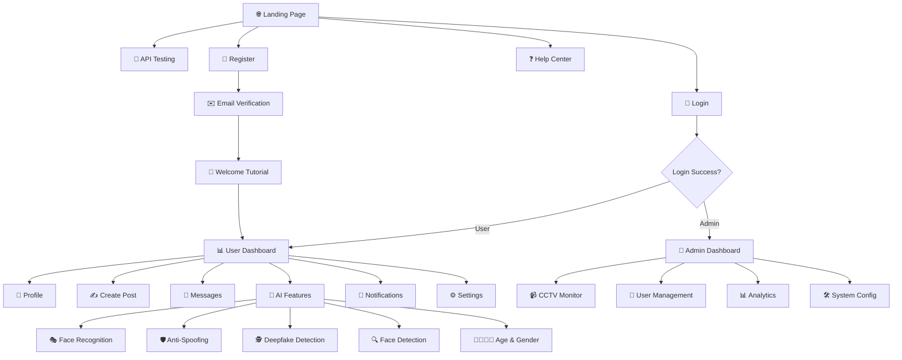

# FaceSocial Navigation Map & User Flow

## 🗺️ Complete Site Map



## 🎯 User Journey Flows

### 1. New User Complete Journey

```
🚀 First Time User Journey
┌─────────────────────────────────────────────────────────┐
│ 1. Discovery Phase                                      │
│    🌐 Landing Page                                      │
│    ├── 📖 Learn about FaceSocial                       │
│    ├── 🧪 Try AI features (Guest mode)                 │
│    ├── 👀 Watch demo videos                            │
│    └── 📄 Read privacy policy                          │
│                                                         │
│ 2. Registration Phase                                   │
│    📝 Registration Form                                 │
│    ├── 📧 Email & basic info                           │
│    ├── 🔑 Create secure password                       │
│    ├── 📱 Optional phone number                        │
│    ├── 👤 Face registration (Optional)                 │
│    └── ✅ Accept terms & privacy                       │
│                                                         │
│ 3. Verification Phase                                   │
│    ✉️ Email Verification                                │
│    ├── 📨 Receive verification email                   │
│    ├── 🔗 Click verification link                      │
│    └── ✅ Account activated                            │
│                                                         │
│ 4. Onboarding Phase                                     │
│    🎉 Welcome Tutorial                                  │
│    ├── 🎯 Set goals and interests                      │
│    ├── 👤 Complete profile setup                       │
│    ├── 🔒 Configure privacy settings                   │
│    ├── 🔔 Set notification preferences                 │
│    ├── 🤖 Learn about AI features                      │
│    └── 👥 Find and follow friends                      │
│                                                         │
│ 5. First Use Phase                                      │
│    📊 Dashboard Introduction                            │
│    ├── ✍️ Create first post                            │
│    ├── 🎭 Try face recognition                         │
│    ├── 💬 Send first message                           │
│    └── 🔍 Explore AI features                          │
└─────────────────────────────────────────────────────────┘
```

### 2. Daily User Flow

```
📱 Typical Daily User Session
┌─────────────────────────────────────────────────────────┐
│ Morning Login (08:00-10:00)                            │
│ 🔐 Face Recognition Login                               │
│ ├── 📊 Check dashboard notifications                   │
│ ├── 👀 Browse morning feed                             │
│ ├── ❤️ React to friends' posts                         │
│ └── 📱 Quick status update                             │
│                                                         │
│ Lunch Break Activity (12:00-13:00)                     │
│ 📱 Mobile browsing                                      │
│ ├── 💬 Reply to messages                               │
│ ├── 📷 Share lunch photo with AI tagging               │
│ ├── 🔔 Respond to notifications                        │
│ └── 🤖 Quick AI feature usage                          │
│                                                         │
│ Evening Engagement (18:00-22:00)                       │
│ 💻 Desktop experience                                   │
│ ├── ✍️ Create detailed posts                           │
│ ├── 💬 Longer conversations                            │
│ ├── 🎭 Explore AI features                             │
│ ├── ⚙️ Adjust settings                                 │
│ └── 👥 Discover new connections                        │
└─────────────────────────────────────────────────────────┘
```

### 3. Admin User Flow

```
👑 Admin Daily Operations
┌─────────────────────────────────────────────────────────┐
│ Security Check & System Overview (09:00)               │
│ 🛡️ Enhanced Authentication                              │
│ ├── 👤 Face + 2FA verification                         │
│ ├── 📍 Location verification                           │
│ ├── 🔐 Admin password confirmation                     │
│ └── 🚨 Review security alerts                          │
│                                                         │
│ Morning Monitoring (09:30-11:00)                       │
│ 📊 Admin Dashboard                                      │
│ ├── 📈 Check system health                             │
│ ├── 👥 Review new user registrations                   │
│ ├── 🚨 Handle reported content                         │
│ ├── 📹 Monitor CCTV if applicable                      │
│ └── 🤖 Check AI service status                         │
│                                                         │
│ User Management (11:00-12:00)                          │
│ 👥 User Administration                                  │
│ ├── ✅ Approve face verifications                      │
│ ├── 🔒 Handle account issues                           │
│ ├── ⚖️ Review policy violations                        │
│ └── 📊 Analyze user behavior                           │
│                                                         │
│ System Maintenance (Afternoon)                         │
│ 🛠️ Technical Operations                                 │
│ ├── 🔄 Update AI models                                │
│ ├── 📊 Generate reports                                │
│ ├── ⚙️ Adjust system settings                          │
│ └── 💾 Monitor data backup                             │
│                                                         │
│ End of Day Review (17:00-18:00)                        │
│ 📋 Daily Summary                                        │
│ ├── 📈 Review analytics                                │
│ ├── 📝 Update documentation                            │
│ ├── 🎯 Plan tomorrow's priorities                      │
│ └── 🔐 Secure logout                                   │
└─────────────────────────────────────────────────────────┘
```

## 🔀 Cross-Platform Navigation

### Desktop Navigation Pattern
```
┌─────────────────────────────────────────────────────────┐
│ 🖥️ Desktop Layout (1200px+)                            │
├─────────────────────────────────────────────────────────┤
│ Top Bar: Logo | Search | Notifications | Profile       │
├─────────┬─────────────────────────────┬─────────────────┤
│ Left    │ Main Content Area           │ Right Panel     │
│ Sidebar │                             │                 │
│ - Home  │ ┌─────────────────────────┐ │ - Quick AI      │
│ - AI    │ │ Feed / Dashboard        │ │ - Suggestions   │
│ - Chat  │ │                         │ │ - Trending      │
│ - CCTV  │ │                         │ │ - Status        │
│ - More  │ └─────────────────────────┘ │                 │
└─────────┴─────────────────────────────┴─────────────────┘
```

### Tablet Navigation Pattern
```
┌─────────────────────────────────────────────────────────┐
│ 📱 Tablet Layout (768px-1199px)                        │
├─────────────────────────────────────────────────────────┤
│ Top Bar: ☰ Menu | Logo | Search | Profile              │
├─────────────────────────────────────────────────────────┤
│ Main Content Area (Full Width)                         │
│ ┌─────────────────────────────────────────────────────┐ │
│ │ Feed / Dashboard / Feature Content                  │ │
│ │                                                     │ │
│ │ Right Panel content moves below main content        │ │
│ └─────────────────────────────────────────────────────┘ │
├─────────────────────────────────────────────────────────┤
│ Collapsible Sidebar (Overlay when open)                │
└─────────────────────────────────────────────────────────┘
```

### Mobile Navigation Pattern
```
┌─────────────────────────────────────────────────────────┐
│ 📱 Mobile Layout (<768px)                              │
├─────────────────────────────────────────────────────────┤
│ Top Bar: ☰ | Logo | 🔔 | 👤                            │
├─────────────────────────────────────────────────────────┤
│ Main Content (Full Screen)                             │
│ ┌─────────────────────────────────────────────────────┐ │
│ │                                                     │ │
│ │ Single column content                               │ │
│ │ Touch-optimized interface                           │ │
│ │                                                     │ │
│ └─────────────────────────────────────────────────────┘ │
├─────────────────────────────────────────────────────────┤
│ Bottom Navigation                                       │
│ [🏠 Home] [🔍 AI] [➕ Post] [💬 Chat] [👤 Profile]     │
└─────────────────────────────────────────────────────────┘
```

## 🚦 URL Structure & Routing

### Public Routes (No Authentication)
```
/ ................................ Landing Page
/about .............................. About FaceSocial
/features .......................... Feature Overview
/pricing ........................... Pricing Plans
/privacy ........................... Privacy Policy
/terms ............................. Terms of Service
/help .............................. Help Center
/help/faq ......................... Frequently Asked Questions
/help/contact ..................... Contact Support
/api-test ......................... Public AI Testing
/login ............................ Login Page
/register ......................... Registration Page
/forgot-password .................. Password Recovery
/reset-password/:token ............ Password Reset
/verify-email/:token .............. Email Verification
/status ........................... System Status
```

### User Routes (Authentication Required)
```
/dashboard ........................ Main Dashboard
/profile/:username ................ User Profile
/profile/me ....................... Own Profile
/profile/edit ..................... Edit Profile
/settings ......................... Settings Hub
/settings/account ................. Account Settings
/settings/privacy ................. Privacy Settings
/settings/security ................ Security Settings
/settings/notifications ........... Notification Settings
/settings/ai ...................... AI Preferences
/posts/create ..................... Create New Post
/posts/:id ........................ View Post
/messages ......................... Chat Overview
/messages/:conversationId ......... Conversation
/notifications .................... Notification Center
/ai .............................. AI Features Hub
/ai/face-recognition .............. Face Recognition Tool
/ai/face-detection ................ Face Detection Tool
/ai/antispoofing .................. Anti-spoofing Tool
/ai/deepfake-detection ............ Deepfake Detection Tool
/ai/age-gender .................... Age & Gender Detection
/ai/history ....................... AI Usage History
/search ........................... Search Results
/search/people .................... People Search
/search/posts ..................... Post Search
```

### Admin Routes (Admin Authentication Required)
```
/admin ............................ Admin Dashboard
/admin/users ...................... User Management
/admin/users/:id .................. User Details
/admin/posts ...................... Post Moderation
/admin/reports .................... User Reports
/admin/analytics .................. Analytics Dashboard
/admin/cctv ....................... CCTV Monitoring
/admin/cctv/:cameraId ............. Specific Camera
/admin/settings ................... System Configuration
/admin/ai-models .................. AI Model Management
/admin/security ................... Security Center
/admin/logs ....................... System Logs
/admin/backup ..................... Backup Management
```

## 🔄 State Management Flow

### Authentication State
```typescript
interface AuthState {
  user: User | null
  isAuthenticated: boolean
  isLoading: boolean
  loginMethod: 'password' | 'face' | 'social' | null
  permissions: Permission[]
  sessionExpiry: Date | null
}
```

### UI State
```typescript
interface UIState {
  theme: 'light' | 'dark' | 'system'
  sidebarOpen: boolean
  notifications: Notification[]
  modals: Modal[]
  loading: Record<string, boolean>
  errors: Record<string, string>
}
```

### AI Service State
```typescript
interface AIState {
  services: {
    faceRecognition: ServiceStatus
    faceDetection: ServiceStatus
    antispoofing: ServiceStatus
    deepfakeDetection: ServiceStatus
    ageGender: ServiceStatus
  }
  currentProcessing: ProcessingJob[]
  history: AIHistory[]
  preferences: AIPreferences
}
```

---

**Navigation Principles:**
1. **Consistent**: Same navigation patterns across all pages
2. **Intuitive**: Clear visual hierarchy and logical grouping
3. **Accessible**: Keyboard navigation and screen reader support
4. **Responsive**: Adaptive navigation for all screen sizes
5. **Fast**: Optimized routing with proper caching
